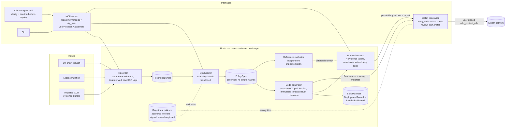

# OpenZeppelin Accounts Policy Builder — Technical Architecture & Delivery Plan

**Project:** Record a Transaction, Generate a Minimum-Permission Soroban Policy
**RFP:** SCF Build Award, RFP Track — "OZ accounts policy builder"
**Status:** Architecture v0.8 · July 2026
(v0.1 → v0.7 across five review rounds plus the TDD/engineering additions — history in §13;
v0.7 → v0.8 after sixth-pass review: the call-surface check is now a **two-surface account
authority check** — a weak `CallContract(account_address)` rule can reach every management
entrypoint (`CallContract` scoping discards function names) and thereby create or weaken
rules indirectly, so the management surface is checked with the same rigor as the direct
policy surface; plus exact-ledger verdict semantics (freshness = retry policy, never a
security interval), `E_INCOMPLETE_ACCOUNT_STATE` with structured causes, extant-rule
`Count` terminology, and `call-surface-core` added to the enforced core-crate list.)
**License:** Apache-2.0 (all deliverables, built in the open under `github.com/gateway-fm`)

---

## 1. Problem statement

OpenZeppelin's Stellar smart accounts (`stellar-accounts`) give Soroban real programmable
authorization: **context rules** scope *which contract may be called*, **signers** say *who
may authorize*, and **policies** — external Soroban contracts implementing the OZ `Policy`
trait — enforce *what exactly is allowed* (amounts, thresholds, windows). The primitives are
audited and live, but authoring a custom policy today means hand-writing a Soroban contract,
which is too high a bar for most developers and impossible for end users. The result: the
delegation infrastructure exists but goes unused.

This toolkit closes that gap with a **record-and-generate** workflow. A user (or an AI agent)
points at a transaction they *already performed* — on-chain by hash, locally simulated, or
imported as a raw evidence bundle — and the toolkit synthesizes a context rule plus a
**small, validated composition of policies**. The guarantee is stated precisely:
**exact-by-default synthesis** (every observed argument constrained to exactly what was
observed), followed by **exact conformance to the canonical PolicySpec** containing every
explicit user widening and adapter-derived constraint — the **authorization-minimal** grant
of §6.1, denying every authorization shape outside it. The output is human-readable Rust,
backed by a permit/deny dry-run evidence report. **Code-first, deploy-second**: nothing is
ever deployed automatically; the user reviews, optionally edits, and signs.

A second-order goal, taken directly from the RFP framing: *agents acting under tightly scoped
policies are categorically safer than agents holding full account keys.* The same MCP server
that drafts a policy also lets an agent verify, ahead of time, whether a proposed action would
be permitted under an installed policy it understands (§4.6).

---

## 2. Requirements coverage

The RFP (SCF Handbook, Build Award → RFP Track, Q2 2026) lists eleven minimum requirements,
ten expected deliverables, and eight evaluation criteria. Mapping to this architecture, with the
milestone that contracts each one — a requirement addressed by a later milestone is designed here
and delivered then:

| # | RFP requirement | Where it is addressed |
|---|---|---|
| 1 | Transaction recording/observation layer (on-chain by hash on mainnet/testnet, or locally simulated), extracting contracts, functions, args, state changes, token movements | §4.1 Recorder — **Tranche 1** |
| 2 | Context rule + policy synthesizer, biased toward minimal permissions | §4.2–4.3 PolicySpec + Synthesizer — **Tranche 1** |
| 3 | Generated Rust policy code, compilable Soroban contracts, OZ primitives first, correct `Policy` trait + storage segregation | §4.4 Code generation, §5 Generated-code contract — **Tranche 1** |
| 4 | MCP server: recording, synthesis, verification; structured I/O, deterministic, machine-readable errors | §4.6 MCP server — **Tranche 1** for recording and synthesis; verification with the milestone that delivers it |
| 5 | Agent skill with conversational entry point and clarification questions | §4.7 Agent skill — **Tranche 2** |
| 6 | Simulation/dry-run harness: original must permit, adjacent mutations must deny | §4.5 Dry-run harness — **Tranche 2** |
| 7 | Wallet integration with at least one Stellar smart-account wallet, end-to-end record → generate → simulate → sign → install | §4.8 Wallet integration — **Tranche 2** |
| 8 | Documentation + ≥3 end-to-end walkthroughs (Blend yield, SEP-41 subscription, bounded Soroswap) | §7 Walkthroughs, §10 Deliverables — walkthroughs **Tranche 2**, full documentation **Tranche 3** |
| 9 | Configurable composition/generation mode; user can inspect and modify generated code | §4.3 (compose-first decision tree), §4.4 (verified vs custom source modes) — **Tranche 1** |
| 10 | Code-first, deploy-second; deployment never automatic | §6 Trust model — **Tranche 1**, and every milestone after it |
| 11 | Open source, permissive license | Apache-2.0, public repos from day one — **Tranche 0** |

Track-level requirements (visual diagram, plain-English stack description, decentralization,
infrastructure, privacy, maintenance plan) are covered in §3, §6, §9, and §10.

Evaluation-criteria highlights addressed by design:

- **Security & audit story:** the audit target is the full authorization-to-install path —
  recorder-to-spec soundness, signer enforcement, capability registries and their
  governance, the policy call-surface check, synthesizer decision logic, template library,
  generated stateful contracts, install-transaction construction, and build isolation — not
  just sample outputs (§6.4).
- **Building on existing work:** explicit adopt/extend/replace analysis of
  `kalepail/pollywallet` (§4.9).
- **Coordination with OpenZeppelin:** engagement plan as technical reviewer, with concrete
  review gates and an upstreaming path for new primitives (§11).
- **Ecosystem alignment:** integration targets the OZ smart-account stack used by the
  C-Address Tooling cohort wallets; coordination planned with that cohort (§4.8, §11).

---

## 3. System overview



Plain-English stack: a single Rust workspace produces one codebase and one executable image
embedding the recorder, synthesizer, code generator, reference evaluator, and dry-run
harness, exposed three ways — as an MCP server (stdio + streamable HTTP), as a CLI, and as a
library consumed by the wallet backend. In hosted deployments the same image runs in two
roles — an API role and an isolated, no-secrets sandbox-worker role (for compilation and
contract execution) — communicating over a narrow job protocol; in local/stdio use it runs as
one process inside the user's own trust domain. A Claude skill drives the MCP tools
conversationally. The wallet (pollywallet, extended) renders the generated code and the
dry-run evidence report and lets the user authorize the on-chain install with their passkey.
Generated policies are ordinary Soroban contracts implementing the OpenZeppelin `Policy`
trait; installation uses the smart account's own `add_context_rule` / `add_policy` entry
points.

Everything trust-bearing is deterministic and reproducible: the same canonical **PolicySpec**
plus identical pinned build inputs ⇒ byte-identical policy source, byte-identical wasm,
identical offline verdicts (§6.3). The LLM never decides the bytes; it only orchestrates
deterministic tools.

---

## 4. Component architecture

### 4.1 Recording layer (`crates/recorder`)

**Purpose:** turn a transaction — executed, simulated, or imported — into a precise,
replay-invariant **RecordingBundle** with a code-derived evidence trust level.

**Inputs (three paths, same output type):**

- *Executed:* Soroban RPC `getTransaction(hash)` → decode `envelopeXdr` →
  `InvokeHostFunctionOp.auth: Vec<SorobanAuthorizationEntry>` (the authorization tree the
  network actually verified), plus `resultMetaXdr` for effects. **Retention caveat
  (documented, surfaced in the UI):** standard RPC retention is short (typically 24 hours,
  up to 7 days) — recording by hash only works within that window.
- *Simulated:* build/accept an unsigned envelope, call `simulateTransaction` with explicit
  `authMode: "record"` (or `"record_allow_nonroot"` for nested auth) → `results[0].auth`
  gives the same `SorobanAuthorizationEntry` XDR type, unsigned; `stateChanges` gives
  simulated ledger-entry diffs. Unsigned simulations may encode private, never-submitted
  intentions and are treated as confidential input (§6.5).
- *Imported:* a self-contained raw-XDR evidence bundle (envelope + result + meta + anchor
  metadata), or a configured indexer/ledger-data backend, for transactions outside RPC
  retention. Incomplete historical data is never silently substituted — missing evidence is
  reported as missing.

**Evidence trust levels — derived by code from the acquisition path, never selectable by the
caller.** Hashing a supplied bundle proves internal identity, not that the network accepted
it in the claimed ledger. Every bundle carries a trust classification, propagated into every
downstream report, with provenance recording backend identity, endpoint configuration
identity, response digest, and observation time:

| Level | Meaning |
|---|---|
| `rpc_reported` | fetched live from the configured RPC endpoint — trusted exactly as far as that endpoint is trusted (the name says *reported*, not proven) |
| `ledger_verified` | inclusion **proven** against a pinned trusted checkpoint / ledger-hash source: transaction-hash derivation checked and header/inclusion binding verified. Partial verification never earns this label |
| `trusted_indexer` | supplied by an explicitly configured, trusted historical backend (a network-read acquisition, not an import) |
| `self_supplied` | user-imported; internally consistent but **unverified** — never described as a verified executed transaction. This is the default result of a pure import |
| `incomplete` | missing evidence; synthesis restricted or refused |

**What is extracted:**

1. **Auth invocation tree** per authorizing address: `rootInvocation` / `subInvocations`
   recursion over `SorobanAuthorizedFunction` →
   `InvokeContractArgs { contractAddress, functionName, args }`. This is the primary,
   *enforceable* signal — it is exactly what the account's `__check_auth` sees as
   `Vec<Context>`.
2. **Token movements:** SEP-41/CAP-67 events (`transfer`, `mint`, `burn`, `approve`) from
   transaction meta — handling **both** `TransactionMetaV3` (`sorobanMeta.events`) and
   `TransactionMetaV4` (`operations[i].events`, protocol 23+).
3. **State diffs:** `LedgerEntryChanges` pairs (`STATE`→`UPDATED`, `CREATED`, `REMOVED`,
   `RESTORED`) from operation meta, or `stateChanges` from simulation.
4. **Anchors:** ledger sequence + close time (`ledger`, `createdAt`), network ID (hash of the
   passphrase from `getNetwork`), protocol and meta versions, target-contract executable
   hashes observed at recording time.

**Evidence vs enforcement.** Only the authorization tree is an enforcement fact. Events and
state diffs are *explanatory evidence*: they help the user and the synthesizer understand
what happened, but they never drive automatic constraints on their own, because effects
cannot always be causally attributed to a specific authorization entry. Every piece of
evidence carries its source and attribution confidence; unattributable effects are labeled
as such.

**Authorizer selection and account recognition.** A transaction may contain several
authorizing addresses (including ordinary G-accounts). Recording requires selecting *which*
authorizer the grant is for, and the selected authorizer is resolved through the **account
capability registry** (§4.10) by `(network ID, observed account wasm hash)` — an observed
hash does not intrinsically reveal a release or audit status, so recognition comes from the
registry, with interface probing only as a supplement. The bundle carries an **account
compatibility record**: network ID, smart-account address, observed code hash, registry
resolution (release identity, supported interface, auth-digest format, management/batch
capabilities including release-specific return/event schemas, admin-rule semantics,
deprecation status), and a verdict on whether a safe install can be prepared. Unknown or
incompatible account hashes **fail closed**. The spec's `SELF` marker always refers to this
selected smart account.

**Correctness constraints the recorder is built around** (verified against the XDR
definitions and CAP-46-11):

- The auth tree is a **projection** of the call graph: only frames where that address's
  `require_auth` fired appear. Sub-invocations without auth are invisible; the fingerprint
  must not be confused with the full call tree.
- `require_auth_for_args` means **auth-entry args may differ from actual call args** — the
  recorder records what was *authorized*, labels it as such, and never assumes it equals what
  was *called*.
- All four `SorobanCredentials` arms are handled: `SourceAccount`, `Address`, and the two
  Protocol 27 (CAP-71) additions `AddressV2` and `AddressWithDelegates` (recursing the
  delegate signature tree). The credential *kind* is recorded; signature material irrelevant
  to policy synthesis is not retained in the fingerprint.
- Fee-bump and multi-operation envelopes are parsed with explicit operation selection.
- Failed executed transactions are rejected as behavior examples unless the user explicitly
  opts into a failure-analysis mode.
- Contract-invoker authorization (`authorize_as_current_contract`) never appears in tx-level
  auth entries; the bundle documents this boundary explicitly.

**Two identities, both hashed with domain separation and a specified canonical encoding:**

- **Authorization fingerprint** — `sha256` over canonical XDR of
  `(authorizer address, rootInvocation)`; groups equivalent authorization contexts.
- **Full recording hash** — over network ID, raw envelope/result/meta XDR, operation index,
  selected authorizer, ledger anchor, decoded evidence, evidence trust level, schema
  version, and canonicalization version; uniquely identifies the complete synthesis input.

Raw XDR is always preserved alongside decoded views — decoding never replaces evidence.
Recording sessions group multiple transactions (the RFP's canonical "claim on Blend, then
convert to USDC" flow) into one bundle with **canonical ordering and deduplication rules**,
so a permission bundle hashes deterministically; the PolicySpec maps each rule/tuple to the
exact justifying invocation(s) (§4.2).

**Stack:** `stellar-xdr` 27.x (`curr`, `base64`, `serde`), `stellar-rpc-client` 27.x,
`stellar-strkey`. Works against any Soroban RPC endpoint (user-configurable; Gateway's public
mainnet/testnet RPC is the default reference, never a requirement).

### 4.2 PolicySpec and the artifact chain

Between recording and code generation sits a **versioned, JSON-serializable canonical
specification** (`policy-spec/v1`, resolvable JSON Schema URI, canonical serialization
rules). Everything user-facing (wallet editor, skill clarification, docs) operates on the
spec, never on raw Rust. The spec is the *audit boundary*: synthesizer output and codegen
input are both PolicySpec, so both sides can be tested exhaustively against it — including by
an independently implemented reference evaluator (§4.5).

**The artifact chain is acyclic.** A PolicySpec contains **no build outputs** — no manifest
hash, no generated code hashes. Each later stage references earlier stages by hash, never the
reverse:

```text
RecordingBundle(s)                    (evidence; full recording hashes)
  └─▶ PolicySpec                      (canonical synthesis output / codegen input;
        │                              references recordings + registry snapshot)
        └─▶ BuildManifest(s)          (one per generated policy; references PolicySpec hash;
        │                              adds source hash, wasm hash, toolchain/lockfile/
        │                              template-pack/image digests)
        └─▶ DeploymentRecord(s)       (per deployed or reused instance; network, contract
        │                              address, observed on-chain code hash, deploy tx)
        └─▶ PolicyBindingSet          (per spec policy: network, exact contract address,
        │                              observed wasm hash, recognition = reviewed_registry |
        │                              verified_generated_manifest, deployment/reference
        │                              evidence — the input to the call-surface check)
        └─▶ InstallationRecord        (references the binding set; account, rule/policy
                                       IDs, install tx hash + ledger, verified events,
                                       call-surface check result + ledger window)
```

Any convenience "resolved view" that joins these for display is explicitly non-canonical and
never hashed. Expected code hashes for *pre-existing reviewed contracts* (OZ prebuilt
policies, verifiers, adapter-reviewed targets) do appear in the spec — those are inputs,
resolved through the capability registries, not outputs of this build. Generated policies
are referenced **by template family**, never by a wasm hash that doesn't exist yet (§4.10).

```jsonc
{
  "schema": "policy-spec/v1",
  "name": "blend-claim-only",            // ≤20 chars, matches contract MAX_NAME_SIZE
  "network_id": "…",                     // hash of network passphrase, not a display name
  "registry_snapshot": "sha256:…",       // root hash of the registry snapshot used (§4.10)
  "smart_account": {                     // account compatibility record (§4.1, §4.10)
    "address": "C…",
    "observed_code_hash": "…",
    "registry_resolution": "stellar-accounts@0.7.x (registry entry sha256:…)",
    "install_rule": { "id": 0, "role": "admin" },
    "install_safe": true
  },
  "rules": [{
    "context": {
      "type": "CallContract", "contract": "C…",
      "target_code_hash": { "hash": "…", "role": "evidence_only",   // or "adapter_required"
                            "observed_ledger": 4100000, "on_drift": "warn" } // or "refuse"
    },
    "valid_until": { "ledger": 4123456, "approx_time": "2026-10-01T00:00:00Z" },
    "authorization": {                   // REQUIRED: the signer predicate for this grant
      "kind": "any_of",                  // any_of | all_of | threshold(n) | weighted(…)
                                         //   | any_of_current_rule_signers (dynamic, §4.3)
      "strict_signer_set": true,         // default & mandatory for named identities (§4.3)
      "signers": [
        { "type": "External", "verifier": "C…", "verifier_code_hash": "…",
          "verifier_registry_entry": "sha256:…", "key": "…" }
      ]
    },
    "allowed_calls": [                   // disjunction of COMPLETE argument tuples
      { "fn": "claim",
        "args": [
          { "i": 0, "c": { "eq_address": "SELF" },  "prov": "observed_exact" },
          { "i": 1, "c": { "eq_scval": "…" },       "prov": "observed_exact" },
          { "i": 2, "c": { "eq_address": "SELF" },  "prov": "observed_exact" }
        ],
        "justified_by": ["recordings[0]/auth[0]/root"] }   // evidence mapping
    ],
    "policies": [
      { "kind": "oz:spending_limit",
        "capability": "sha256:…",        // reviewed-wasm-hash key into the policy registry
        "params": { "limit": "50_0000000", "period_ledgers": 120960 } },
      { "kind": "gen:scope+count",
        "template_family": "policy-templates/scope@1",     // audited template-pack identity
        "capability_schema": "sha256:…" }                  // its declared capability algebra
    ],
    "state": [                           // executable invariants, not intent labels (§4.4)
      { "counter": "call_count", "scope": "lifetime", "storage": "persistent",
        "missing_state": "deny", "init": "install_only", "capacity": 1 }
    ]
  }],
  "evidence": {
    "recordings": [ { "hash": "sha256:…", "trust": "rpc_reported" } ]  // canonical order, deduped
  }
}
```

Key properties:

- **`authorization` is mandatory.** Every synthesized grant declares a signer predicate;
  "no signer required" exists only as a deliberate, explicitly-selected public-execution
  mode with prominent warnings. Validation checks — via the **capability registries**
  (§4.10), never via claimed kinds — that at least one attached policy enforces the declared
  predicate (§4.3). This closes the zero-signer authorization hole (§5, sharp edge #1).
- **Fixed identities are strict.** Predicates over named signers require the strict
  signer-set check; the explicitly dynamic predicate is a different, labeled thing (§4.3,
  Decision D1).
- **Allowed calls are complete tuples**, each mapped to the recorded invocation(s) that
  justify it. Multiple observations become a *disjunction of tuples* — never independent
  per-index allowlists.
- **Every constraint carries provenance:** `observed_exact`, `user_widened` (with the user's
  stated intent and a blast-radius label), or `adapter_derived` (with the adapter identity
  and code-hash binding). For adapter-derived claims the expected target hash is a canonical
  spec input, checked at generation, installation, and live preflight; where it cannot be
  enforced on-chain, reports call it monitored state-dependent evidence, not a permanent
  invariant.
- **Enforceable vs observational is explicit.** Constraints derive only from the
  authorization context; event/state evidence appears in rationale fields.
- **State semantics are executable invariants** (§4.4).
- The schema is closed — unknown constraint kinds are rejected; any contract/function not
  explicitly listed is **denied by default**; validation enforces the on-chain limits
  (≤5 policies, ≤15 signers, name ≤20 chars per rule).

### 4.3 Synthesizer (`crates/synthesizer`)

**Purpose:** RecordingBundle(s) → minimal PolicySpec. Pure function, no I/O, fully
deterministic, property-tested, **fail-closed**: when an observation's meaning cannot be
established, the synthesizer refuses with a machine-readable explanation instead of guessing.

Derivation rules:

- **Scope:** one `CallContract` context rule per contract that received an authorized
  invocation from the selected smart account. Never a `Default` (match-anything) rule —
  minimum permission is structural, not optional.
- **Authorization:** the delegate signer set and predicate come from explicit user input
  (who is this grant *for*?) — they cannot be inferred from the recording and are a required
  question, not a default. **Strict signer-set semantics are the default and are mandatory
  in verified mode whenever the predicate names concrete identities:** the generated policy
  stores a canonical hash over the exact stored `Signer` XDR values (deterministic ordering;
  never substituting verifier-level key canonicalization for the representation the account
  actually matches) and **denies when the rule's live signer set diverges** — so a later
  `add_signer` by any authorized client cannot silently broaden who satisfies the grant. A
  separate, explicitly labeled **dynamic predicate** (`any_of_current_rule_signers`) exists
  for grants that *intend* rule-managed signer rotation; it makes no claim that the original
  identities remain authoritative, and the wallet/report say so. The dynamic predicate still
  **denies an empty authenticated set** — tested against rules whose live signer set has
  shrunk to zero while policies remain attached — and the spec records the initially
  installed signer set separately from the predicate's dynamic semantics. (Decision D1, §13.)
- **Function + argument scoping — exact by default.** Every observed argument becomes a deep
  exact-equality constraint on the complete tuple (exact argument count; full nested `ScVal`
  shape validated before any indexing). **Widening is never heuristic.** A bound like "any
  amount up to 100" enters the spec only through:
  1. an **explicit user decision** naming the semantic role and bound direction (elicited by
     the skill/wallet), with a blast-radius label proportional to what it unconstrains —
     e.g. accepting "any deadline" is flagged high-blast-radius, with the report stating the
     downstream argument is then unconstrained (the rule's own `valid_until` still bounds
     *when* authorization can occur); or
  2. a **versioned contract adapter** bound to a verified target code hash that declares
     argument semantics — max-input vs min-output vs deadline vs identifier — for that
     specific contract (§6.1). The XDR type alone never determines direction: lowering a
     minimum-output makes a swap *less* safe, so `<= observed` as a generic rule is unsound.
- **Value caps:** token-movement events *suggest* which argument carries value; the
  suggestion is presented as evidence for the user/adapter decision, never applied silently.
  SEP-41 `transfer` cadence/rate limiting composes the audited OZ `spending_limit`
  (accounting for its finite history capacity — configurations whose expected call volume
  can exhaust it are rejected at validation).
- **Lifetime:** `valid_until` on the context rule (ledger-denominated; converted from the
  user's wall-clock intent using a measured ledger interval, surfaced as both ledger and
  approximate timestamp).
- **Frequency:** call-count caps (lifetime or windowed) via the generated primitive.
- **Sequences produce a *permission bundle*, not a workflow.** One rule per target contract
  from a multi-tx recording grants *independent* capabilities: it does not enforce ordering,
  dependency, or "B only after A", and either action may be repeated within its own limits.
  The spec, the report, and the UI say so explicitly. Enforced ordered workflows (a
  state-machine policy / coordinator contract) are a designed extension point, not claimed
  in v1.

**Compose-first decision tree (RFP requirement #9 — both modes, configurable):**

1. Can the constraint set be expressed purely by **configuring audited OZ prebuilt policies**
   (`spending_limit`, `simple_threshold`, `weighted_threshold`)? → emit configuration only;
   zero new code. (Boundary condition from the OZ source: `spending_limit` only understands
   `transfer(from, to, amount)` — it asserts the function name, reads the amount from arg
   index 2, does **not** constrain the recipient, and treats zero-amount transfers as no-ops.
   So "compose-only" covers pure spend-rate limiting, and almost every realistic grant needs
   step 2 as well.) **Compose-only is further limited by signer semantics:** no OZ prebuilt
   implements strict signer-set binding, so the zero-code mode is available only for grants
   using the explicit dynamic predicate (enforced by a registered prebuilt, e.g. a threshold
   over the rule's current signers); verified fixed-identity grants always require the
   generated strict signer policy from step 2.
2. Otherwise, **compose OZ policies + one generated policy**: OZ primitives carry
   spend/threshold logic where they fit; the generated policy carries the signer predicate,
   function/argument tuple scoping, call-count, and recipient/path constraints that no
   prebuilt expresses. (A rule carries at most 5 policies, so all custom constraints for one
   context pack into **one** generated contract.)
3. Fully generated only when no OZ primitive applies at all.

In all three modes, validation resolves every composed policy through the **capability
registries** (§4.10) and confirms the declared signer predicate is enforced by at least one
attached policy whose *reviewed* capabilities include it. The proof combines implementation
capability, install parameters, the exact stored rule, and mutation semantics — never the
policy code hash alone (a threshold policy over a mutable live signer set does not prove a
fixed-identity predicate; that is exactly what strict mode exists for). Unknown or
unregistered policies cannot satisfy the predicate and fail validation.

### 4.4 Code generation (`crates/codegen` + `contracts/templates`)

**Design decision — templates, not free-form generation.** The RFP demands deterministic
behavior and an audit of the synthesizer itself; free-form LLM code generation (the approach
in the existing pollywallet prototype) can satisfy neither. A small library of **vetted
constraint snippets** (signer predicate incl. strict-set check, function assert,
tuple-equality assert, bound assert, address allowlist, call-count with storage, window
check) is written by hand once, reviewed with OpenZeppelin, audited, and then *assembled* —
not authored — per policy.

**Specialization model:** generated policies use **immutable per-grant specialization** —
constraint constants are compiled into the wasm, not supplied as runtime configuration.
Rationale: each emitted contract stays trivially reviewable and no general-purpose constraint
interpreter needs auditing. Consequences, embraced explicitly:

- **Normalized codegen input.** The wasm is derived from a normalized subset of the
  PolicySpec containing only fields the contract actually embeds: the constraint tuples,
  predicate, and state invariants. `SELF` is **resolved at runtime** against the
  `smart_account` parameter `enforce` receives (not compiled to a literal address), and
  state is keyed by the runtime `(smart_account, context_rule.id)` — so the same constraint
  set yields the same wasm for *any* account, and equal grants naturally share one
  deployment. Rule names, account addresses, rationale, and evidence links do not affect
  bytes. The normalized-input hash is the pre-build identity that ties a PolicySpec to the
  eventual wasm via the BuildManifest attestation (§4.10).
- **No setters, no upgrade entry point.** Reconfiguration is remove-and-reinstall under the
  account's strong administrative rule (§4.8). (Runtime setters guarded only by
  `smart_account.require_auth()` are a configuration-downgrade path: a weak session rule
  covering the policy contract's address could authorize them — the same reasoning that
  motivates the call-surface check in §4.8.) `install_params` carry only non-security
  bookkeeping, if anything.

**Two source modes (RFP requires user-modifiable code; determinism requires honesty about
what edits cost):**

- **Verified generated mode (default):** users edit the *spec*, and source is regenerated.
  All reproducibility, spec-conformance, differential-testing, and template-audit claims
  apply.
- **Custom source mode:** any manual edit to generated Rust creates a **new custom
  artifact**: it invalidates automated spec conformance (no evaluator can generally prove
  arbitrary Rust equivalent to the spec), requires its own BuildManifest, test run, and
  review/audit status, and is prominently labeled in the wallet and reports. It never
  inherits the generated-policy guarantees.

**Generated-code contract (what every emitted policy guarantees):**

```rust
// Shape of every generated policy (illustrative):
impl Policy for GeneratedPolicy {
    type AccountParams = InstallInfo;   // bookkeeping only; constraints are compiled in

    fn enforce(e: &Env, context: Context, authenticated_signers: Vec<Signer>,
               context_rule: ContextRule, smart_account: Address) {
        smart_account.require_auth();   // only callable mid-__check_auth
        // 0. SIGNER PREDICATE — always first. The OZ account defers signer validation to
        //    policies when a rule has any policy attached, so an unchecked signer list
        //    means anyone can authorize with zero signatures. Panic unless
        //    authenticated_signers satisfies the grant's declared predicate.
        //    Strict mode (default for named identities): also verify the canonical hash
        //    of the rule's live signer set against the compiled-in expected hash, so
        //    later signer mutations fail closed instead of silently changing the grant.
        // 1. context must be Contract(ContractContext { contract, fn_name, args })
        // 2. (contract, fn_name, args) must deep-equal one compiled-in allowed-call
        //    tuple (exact arg count; nested ScVal shapes validated; explicit bounds
        //    only where provenance is user_widened / adapter_derived; SELF compared
        //    against the smart_account parameter at runtime)
        // 3. stateful checks (call count, window), storage keyed by
        //    (smart_account, context_rule.id) under the invariants below
        // any violation: panic_with_error!(e, PolicyError::...)
    }
    fn install(e: &Env, info: InstallInfo, context_rule: ContextRule, smart_account: Address) { ... }
    fn uninstall(e: &Env, context_rule: ContextRule, smart_account: Address) { ... } // best-effort
}
```

- Implements the OZ `Policy` trait exactly as published in `stellar-accounts`
  (`install` / `enforce` / `uninstall`; rejection by panic with registered
  `#[contracterror]` codes). Note: the RFP background text mentions a `can_enforce` hook;
  current audited releases do not have it — we pin to the audited release and track trait
  evolution (§9).
- **Dependencies:** `#![no_std]`, `soroban-sdk` **and** the matching `stellar-accounts`
  release (the trait and its `ContextRule`/`Signer` types live there), both version-matched
  to the pinned audited release and recorded in the BuildManifest.
- **Stateful templates obey executable fail-closed invariants** (each an explicit
  precondition/transition with tests, per state primitive):
  - `install` is the **only** operation that may initialize the `(account, rule ID)` state;
  - `enforce` **never treats missing state as zero** — missing or unavailable state denies;
  - archived persistent state must be restored (surfaced via simulation/preflight
    restoration preambles) before enforcement can proceed; enforcement over unrestorable
    state denies;
  - reinstalling after removal is a requirement on the **installer flow, not on the policy
    contract**, and is **not enforced by the artifact**: the policy keys its state by
    `(account, context rule ID)`, so if the account reuses a removed rule's ID then `install`
    starts a fresh counter at zero and the contract cannot tell that apart from a first
    installation. Allocating a new rule identity and surfacing the reinstall to the user as a
    new grant is therefore the wallet's or installer's responsibility;
  - TTL extension is bounded by the network's current maximum — `e.storage().max_ttl()`, the
    number of ledgers an entry may live from the current one (the SDK derives it as
    `Env::ledger().max_live_until_ledger()` minus `Env::ledger().sequence()`) — and may
    require periodic extension; no-expiry or beyond-max-TTL rules may fail closed
    pending restoration rather than promising continuous liveness;
  - uninstall/reinstall sequences and stale-state collisions have explicit tests;
  - a call cap never resets **within an installation** due to inactivity, TTL expiry, or
    archival — an archived persistent entry is restored with its value preserved, so allowing
    the counter to archive cannot reset it. It is not a *lifetime* cap: `uninstall` removes the
    counter entry and a later `install` legitimately starts from zero. Both are gated on
    `smart_account.require_auth()`, so only the account's owner can reach that path, and it is
    a new grant rather than a reset of an existing one — but the guarantee stated to a user must
    be "per installation", never "lifetime".
- **Rendering safety:** all symbols, strings, bytes, and `ScVal` values from recordings are
  untrusted data. They are never interpolated into Rust identifiers, and they reach a string
  or byte literal only through a **render-safe literal type** (`crates/codegen/src/render.rs`:
  `Strkey`, `SymbolName`, `I128Literal`, `ByteArray`) whose single fallible constructor runs
  the validator — a checksummed strkey decode, the Soroban symbol charset, a canonical `i128`
  round-trip, or a byte decode. The emitter is handed a `RenderRule` and never sees a
  `RuleSpec`, so no raw recorded string is in scope to interpolate, and the conversion matches
  `Constraint` exhaustively so a new variant is a compile error rather than an unvalidated
  value. Embedding addresses as encoded byte arrays instead of validated string literals is a
  further structural hardening, deferred to template-pack v2 because it changes every emitted
  artifact's hash. Nesting depth, collection lengths, source size, wasm size, and storage
  footprint are capped.
- Rendering is deterministic: pinned template engine, pinned `rustfmt`, stable ordering.
  Reproducible wasm: pinned Rust toolchain (`rust-toolchain.toml`), `--locked` builds,
  containerized `stellar contract build` by image digest. Full provenance lives in the
  BuildManifest (§6.3), and `verify` (§4.6) automates re-derivation.

### 4.5 Dry-run harness (`crates/harness`)

> **Scope: Tranche 2.** The dry-run harness is a second-milestone deliverable, described here as design rather than as shipped behavior.

Trust is earned by demonstrated permit/deny behavior. The harness produces **evidence, not
proof**: mutation testing shows tested cases behave correctly; it cannot show that every
untested input is denied, and reports say so, listing the tested boundary classes and
coverage.

An executed transaction cannot be literally replayed under a newly installed policy (its
nonce, signatures, rule IDs, expiration, and surrounding state no longer apply), and network
simulation discards writes, so stateful behavior cannot be demonstrated by stateless calls.
The harness therefore runs **four evidence layers**, each labeled in the report:

1. **Reference evaluation** — the PolicySpec evaluated as a pure predicate by an
   **independently implemented reference evaluator** (separate code, no shared logic with
   codegen), with boundary and property tests. Deterministic, offline.
2. **Contract integration** — the real generated wasm executed through a real
   `stellar-accounts` smart account's **complete `__check_auth` path** (AuthPayload
   construction, rule selection, digest binding, signer filtering, policy composition) in a
   local test environment that **commits state and advances ledgers** — this is where
   rolling limits and call-count `N+1` denials are actually demonstrated. Direct `enforce`
   calls remain as unit tests but are not trust-bearing on their own.
3. **Disposable end-to-end environment** — a **semantically reconstructed invocation**
   (fresh nonces/signatures/rule IDs, isolated account and policy state) executed against
   captured target-contract fixtures (wasm + relevant entries fetched via
   `getLedgerEntries`, labeled as captured-at-ledger snapshots, not historical state).
4. **Live preflight** — `simulateTransaction` against current network state with the policy
   deployed (testnet). Labeled **state-dependent evidence**: it depends on ledger sequence,
   target state, archived entries, RPC version, and current policy counters, and is not
   reproducible. Anything that deploys or submits is a **mutating** operation and is never
   annotated read-only.

**Deny suite — derived from constraints, not a fixed list.** For each accepted call tuple,
the generator derives: equality mutations for every scalar and nested value; below/at/above
numeric boundaries (plus min/max extremes); empty, reordered, duplicated, truncated, and
extended collections; cross-products across accepted tuples (must all deny unless observed);
absent/extra/wrong/partially-satisfying signer sets **and mutated signer sets against strict
mode**; alternate rule IDs and context orderings; zero, maximum, and overflow-adjacent call
counts; times just before/at/after each boundary; wrong target contract and network;
rollback checks demonstrating that a failing later policy does not commit an earlier
policy's state; and an **adversarial direct-call suite** that invokes every exported policy
method (`install`, `enforce`, `uninstall`) through alternate account rules to demonstrate
the call-surface assumptions of §4.8. Reconfiguration tests exercise **both rule IDs during
any overlap window and assert aggregate capability**, not each rule in isolation.

Generated wasm is **differentially tested** against the reference evaluator on the full
suite, to catch common-mode failures between codegen and its tests. Every report identifies:
fixture or ledger anchor; account and policy code hashes; evidence trust level; whether state
was captured, current, restored, or mocked; whether writes were committed; and separates
deterministic offline verdicts from live preflight verdicts. The suite is also the
*regression* corpus: every walkthrough and reported edge case becomes a permanent fixture.

### 4.6 MCP server (`crates/mcp-server`)

> **Scope: Tranche 1 for `record` and `synthesize`; later milestones for the rest.** The first milestone contracts an MCP server v0 exposing recording and synthesis. The remaining tools described below — dry-run, authority-surface and install-intent — belong to the milestones that deliver the components behind them.

One codebase and executable image built on the official Rust MCP SDK (`rmcp` 2.x), exposing
the pipeline as deterministic tools. Transports: **stdio** (local/dev, Claude Code default;
single process in the user's trust domain) and **streamable HTTP** (hosted, versioned
endpoint; API role + isolated sandbox-worker role, §3).

| Tool | Classification | Purpose |
|---|---|---|
| `record_transaction` | network read | tx hash (+ network) → RecordingBundle (`rpc_reported`) |
| `record_simulation` | network read; **confidential input** | unsigned envelope → RecordingBundle (RPC `authMode: record`) |
| `import_recording` | pure | raw XDR evidence bundle → RecordingBundle (`self_supplied`; `ledger_verified` only when the bundle carries a self-contained inclusion proof checked against a pinned trusted checkpoint — consulting any external backend is a network-read acquisition instead) |
| `synthesize_policy` | pure | bundle(s) + user decisions → PolicySpec + per-constraint rationale + open questions |
| `evaluate_spec` | pure | PolicySpec + candidate invocation → reference-evaluator verdict |
| `generate_code` | pure render + **sandboxed build** | PolicySpec → Rust source (pure) + reproducible wasm (resource-consuming compilation, isolated worker) + BuildManifest attestation |
| `dry_run` | layered (see §4.5) | offline layers deterministic; live preflight = network read; any testnet deploy/submit mode = **mutating, explicitly gated** |
| `verify` | mixed, reported separately | source reproduction · wasm reproduction · spec conformance · offline behavioral conformance (each deterministic) · current-network preflight (state-dependent) |
| `check_against_policy` | network read, state-dependent, **recognition-scoped** | proposed invocation vs an *installed* policy → predicted permit/deny — only for implementations recognized via a static reviewed-registry entry **or a fully verified generated-artifact attestation** (§4.10). Anything else returns `unsupported`, never a guess. Responses identify the ledger anchor, exact storage entries and configuration read, restore status, and the race window; a live preflight remains the strongest state-dependent evidence, not a durable verdict |
| `check_policy_call_surface` | network read, state-dependent | account + exact `PolicyBindingSet` → **authority-surface verdict** (§4.8) over both the policy and account-management surfaces: an observation at exactly one ledger, with enumeration + dominance evidence |
| `prepare_install_intent` | pure | PolicySpec + account record + completed `PolicyBindingSet` + an authority-surface verdict artifact (it validates artifact consistency; *currency* comes from re-running the scanner before signing) → install operations and parameters |
| `assemble_install_transaction` | network read | intent → unsigned XDR with current sequence, fees, ledger bounds, and restoration preamble handling; **the wallet independently re-validates and re-simulates the returned XDR before requesting any signature** (§4.8) |

Design rules:

- **Determinism as an interface guarantee:** every response carries the relevant artifact
  hashes (RecordingBundle / PolicySpec / BuildManifest), registry snapshot root, schema
  versions, and evidence trust level; pure tools are reproducible byte-for-byte from those
  inputs, and `verify` attests it. State-dependent tools are labeled, never claimed pure.
- **Structured I/O:** typed input schemas and `outputSchema`/`structuredContent` for every
  tool (rmcp `Parameters<T>` + `Json<T>`); no prose-only results.
- **Machine-readable errors:** stable error codes (`E_TX_NOT_FOUND`, `E_RETENTION_EXPIRED`,
  `E_UNSUPPORTED_META_VERSION`, `E_UNSUPPORTED_PATTERN`, `E_AMBIGUOUS_ARG_SEMANTICS`,
  `E_INCOMPATIBLE_ACCOUNT`, `E_UNREGISTERED_POLICY`, `E_UNREGISTERED_VERIFIER`,
  `E_UNSAFE_CALL_SURFACE`, `E_UNSAFE_MANAGEMENT_SURFACE`, `E_INCOMPLETE_ACCOUNT_STATE`,
  `E_SCAN_BUDGET_EXCEEDED`, `E_RULE_LIMITS_EXCEEDED`, …) returned as tool-execution errors
  the agent can act on.
- **Honest annotations, never trusted as control:** correct
  `readOnlyHint`/`destructiveHint`/`idempotentHint` per the table above — and the server
  enforces its own limits regardless, because MCP annotations are hints for clients, not an
  authorization mechanism.
- **No deploy tool for user assets. No signing. No keys.** The server can *prepare* and
  *assemble* an unsigned install transaction; signing and submission always happen in the
  user's wallet (or CLI with the user's own keys).
- **Hosted endpoint hardening:** versioned path (`/v1/mcp`); authentication + rate limits +
  per-tool quotas + cancellation; RPC endpoint **allowlist** (custom endpoints are a
  self-hosted-only feature — no SSRF surface on the hosted service); compilation and any
  contract execution isolated in the no-secrets worker role with strict CPU/memory/time/
  disk/process/artifact/egress limits; XDR/JSON nesting, collection, and request-size
  limits. Self-hostable by anyone (`docker run`, image pinned by digest).
- **Privacy:** request bodies and recording bundles are confidential by default (§6.5).

### 4.7 Agent skill (`skill/`)

> **Scope: Tranche 2.** The agent skill is a second-milestone deliverable, described here as design rather than as shipped behavior.

A packaged Claude skill (portable to other agent frameworks — the skill layer is thin by
design) that wraps the MCP tools with the conversational entry point the RFP describes:
*"the user wants to grant permission to do X; here is a transaction they performed; draft a
policy."*

- **The LLM never decides the bytes.** It orchestrates the deterministic tools, explains
  their output, and relays user decisions. All artifacts (spec, Rust, report, manifests)
  come from tool calls.
- **Clarification is structural, not stylistic.** Exact-by-default synthesis (§4.3) means
  every widening *requires* a user decision; the synthesizer emits the open questions
  (semantic role, bound direction, headroom, lifetime, recipient generalization, frequency,
  strict-vs-dynamic signer semantics, and — always — the delegate signer set), and the
  skill is instructed to resolve each one explicitly before finalizing.
  High-blast-radius widenings are called out as such.
- **Confirm-before-deploy, layered:**
  1. deployment/signing is not an MCP capability at all (§4.6);
  2. the install-handoff step is a human-invoked flow (`disable-model-invocation` on the
     install sub-skill), and any wallet-adjacent tool is marked to require per-call user
     interaction so no permission mode can skip the prompt;
  3. the skill body mandates: show final Rust + dry-run evidence report + call-surface
     check result + plain-English summary of the grant (including what it does *not*
     enforce — §6.1 trust boundary and permission-bundle independence), obtain explicit
     confirmation, then hand off to the wallet flow or emit CLI instructions — never chain
     past that point.
- **Packaging:** a Claude plugin bundling `skills/policy-builder/SKILL.md` + `.mcp.json`
  (stdio for the local binary; HTTP for the hosted endpoint), installable via marketplace or
  as a committed project-level `.claude/skills` + `.mcp.json` pair. The MCP interface follows
  the RFP-referenced Cloudflare Agent Setup conventions for how plugins/MCP/skills compose.

### 4.8 Wallet integration (`wallet/`)

> **Scope: Tranche 2.** Wallet integration is a second-milestone deliverable. Everything below is intended design, including the install flow and the authority-surface check it depends on.

Target stack (the current OZ smart-account generation):

- **Wallet:** `kalepail/pollywallet` — the RFP's named starting point — extended (see §4.9).
- **SDK:** `smart-account-kit` (TypeScript client for OZ smart accounts: context rules,
  signers, policies, passkey signing with the rule-ID-bound auth digest).
- **Fee/submission:** OpenZeppelin Relayer + Channels plugin. (Launchtube was archived in
  March 2026; Channels is its official successor. The relayer is a pluggable submission
  backend; direct RPC submission is kept working as a fallback.)

**Ownership boundary:** the **wallet owns orchestration and authorization construction**. It
may invoke local or hosted read-only assembly/simulation services (§4.6), but it
independently re-validates and re-simulates every returned transaction against its own RPC
before requesting a signature. No external service output is signed unchecked.

**End-to-end flow (the RFP's record → generate → simulate → sign → install), with the
verification steps that make it trustworthy:**

1. **Verify before generating.** User picks a recent transaction (or pastes a hash) → wallet
   backend calls `record_transaction` → authorizer selection + **account recognition via the
   capability registry** (release, interface, auth-digest format, management capabilities;
   fail closed on unknown hashes) → human-readable fingerprint ("what did this transaction
   actually authorize?").
2. `synthesize_policy` → PolicySpec rendered as a visual, editable rule card: **the signer
   predicate and its strict/dynamic semantics**, target (with observed code hash), function,
   complete tuple constraints with provenance badges, state limits, expiration, and —
   prominently — the trust-boundary and unenforceable-effects notes (§6.1). Open questions
   surface as required form fields.
3. `generate_code` → Rust displayed with syntax highlighting, diffable against the template
   baseline; `dry_run` evidence table rendered inline with its layer labels. Spec edits
   regenerate through the deterministic pipeline (**verified generated mode**); direct
   source edits switch the artifact to **custom source mode** with its warnings and reduced
   guarantees (§4.4).
4. **Resolve every policy instance first — deploy ≠ install, differently authorized.**
   The call-surface check needs exact contract addresses, so instance resolution precedes
   it (deploying immutable code grants no account authority, so this ordering costs
   nothing). (a) *Generated policies:* the wallet reuses an existing deployment when the
   BuildManifest's wasm hash is already on-chain, otherwise deploys — relayer-authorized
   after the user's explicit consent — and verifies the deployed hash; each instance gets a
   DeploymentRecord. (b) *Reviewed policies:* the chosen deployed instance address is
   resolved and its observed wasm hash matched against the registry. The result is the
   **PolicyBindingSet**: per spec policy — network, exact contract address, observed wasm
   hash, recognition path (reviewed registry entry or verified generated-artifact
   attestation), and deployment/reference evidence.
5. **Account authority-surface check — live, fail-closed (`PolicyCallSurfaceCheck`; the
   tool name stays, the model covers two surfaces).** Policy methods are guarded only by
   `smart_account.require_auth()`, and the account's *own management methods*
   (`add_context_rule`, `add_signer`, `add_policy`, `remove_policy`,
   `update_context_rule_valid_until`, upgrade/batch entrypoints, …) are guarded the same
   way — `e.current_contract_address().require_auth()`. `CallContract` scoping is by
   address only (function name and arguments are discarded), so **any rule matching a
   bound policy address can call that policy directly, and any rule matching the smart
   account's own address can call its management methods** — including creating a fresh
   weak policy-address rule, adding signers to a protected rule, removing its policies, or
   reviving an expired rule via an expiration update. Checking only the policy surface is
   therefore bypassable one level up; both surfaces get the same rigor:
   - **direct policy surface:** `Default` + `CallContract(each bound policy address)`
     rules, against every exported security-relevant policy method;
   - **account management surface:** `Default` + `CallContract(smart account address)`
     rules, against every exported security-relevant management method of the exact
     recognized account wasm — including integrator-added methods outside the OZ
     `SmartAccount` trait (the registry entry carries the full exported-method inventory;
     an unknown exported method makes the management verdict unsupported).

   Because this is per-instance *rule state*, no code-hash registry can establish it. The
   check evaluates the exact PolicyBindingSet addresses at one observed ledger and is
   re-run immediately before signing:
   - **Enumeration must be exhaustive or the account is unsupported.** The account
     registry entry declares `complete_rule_enumeration:
     onchain_list | bounded_next_id | verified_event_index | none`, where
     `bounded_next_id` is a parameterized operational contract, not a flag:
     `{ schema_version, max_scan_ids, max_rpc_batches, max_transitive_entries,
     archive_policy, snapshot_policy }`. Verified mode supports the first two by default;
     a `verified_event_index` must define its completeness proof, trust root, and
     current-state reconciliation; `none` yields
     `E_ACCOUNT_RULE_ENUMERATION_UNSUPPORTED` — never a partial verdict. The contract API
     alone cannot enumerate (rule IDs are monotonic with holes after removal; the active
     count is not a bound; the next-ID counter is not an exported method), but for
     recognized implementations **ledger state is public**, and the pinned OZ account
     qualifies as `bounded_next_id` under this protocol (Decision D6, §13):
     1. read `NextId`, the extant-rule `Count` (non-removed rules **including expired
        ones** — removal decrements it, expiry does not), and the account code hash from
        instance storage at a recorded ledger;
     2. fetch `ContextRuleData(0..next_id)` in batches, then the **transitive storage
        closure** of every live rule — the referenced `SignerData(id)` / `PolicyData(id)`
        entries (a `ContextRuleEntry` stores IDs, not values: the policy addresses,
        signers, and verifiers the dominance algebra needs live in those separate,
        independently archivable entries) plus any release-specific lookup data;
     3. **reconcile, fail closed on any deficit:** decoded live rule entries must equal
        `Count` at one coherent snapshot, and every referenced transitive entry must be
        present and decodable; otherwise `E_INCOMPLETE_ACCOUNT_STATE` with a structured
        cause (`archived` / `missing` / `undecodable` / `snapshot_mismatch`) — a deficit
        proves a complete verdict is unavailable, not that archival was necessarily the
        cause; the user may restore missing entries and rerun the complete check. This is
        what makes the scan archive-safe: an archived weak rule can be **restored and
        used in the same invocation** (Protocol 23 automatic restoration puts archived
        entries back before the host function runs), so a live-only scan would pass while
        a restore-and-use transaction defeats it before any monitor reacts. **Monitoring
        is detection and remediation; it is never part of the completeness argument.**
     4. **snapshot coherence:** record the ledger of every read; reject mixed-ledger
        batches (bounded re-reads until stable, else fail); re-read the account
        instance/code identity after the scan and retry on change; hash the ordered
        key/value/TTL set into the verdict artifact;
     5. **resource bounds:** if `next_id`, batch count, or closure size exceeds the
        declared bounds, return `E_SCAN_BUDGET_EXCEEDED` — a specific unsupported
        outcome, never a partial result.
     The verified claim is explicitly **"safe at observed ledger L"**: another authorized
     management transaction can still change rules between the scan and install finality —
     that TOCTOU window is a stated trust boundary, narrowed by re-scanning immediately
     before signing, not eliminated. Upstream proposals to OZ, stated precisely: an
     audited `get_context_rule_ids` getter **improves enumeration only**; the only
     mechanism that structurally closes the scan-to-install race is an account method
     that checks an expected rules-version **in the same state transition** as the
     management call.
   - **Dominance is decided conservatively, not generally** — comparing arbitrary rule
     strength is undecidable. The check: (1) fingerprints the one designated
     administrative rule authorized for management; (2) for every other non-expired rule
     on **either surface**, proves via the registries' closed, **method-level capability
     algebra** that it denies every exported security-relevant method of that surface
     (the policy registry lists policy methods per reviewed hash; the account registry
     lists management methods per exact account wasm); (3) accepts an alternate admin
     rule only where a registered, parameter-aware implication function proves it
     equivalent to or stronger than the designated one; (4) rejects custom, unknown, or
     state-dependent comparisons outright.
   - **On failure, verified mode rejects** (`E_UNSAFE_CALL_SURFACE` for the policy
     surface, `E_UNSAFE_MANAGEMENT_SURFACE` for the management surface) with guided
     remediation — identify the exact conflicting rule, explain what it can authorize,
     strengthen or remove it, re-run — and no override exists on either surface
     (Decision D4, §13). The verdict is an **observation at exactly one ledger**:
     `{ observed_ledger, account_code_hash, ordered_state_digest, enumeration_evidence,
     dominance_evidence, result }`, recorded in the InstallationRecord. Any freshness
     window is wallet retry policy, never a security-validity interval — without an
     on-chain rules-version precondition the toolkit cannot know that no unobserved
     mutation happened inside a nominal window, so the scanner re-runs immediately before
     signing/submission. Post-install monitoring alerts and offers the emergency-removal
     flow if a later check fails.
6. **Installation — the step authorized by the user's account.** The wallet resolves the
   account's **strong administrative rule**, simulates the complete install (restoration
   preambles handled), and the user signs **one transaction** —
   `add_context_rule(CallContract(target), name, valid_until, delegate signers,
   { policy → install info })` — with their passkey over the digest-bound payload, submitted
   via Channels.
7. **Record management identity from evidence — release-specific by design.** The account
   capability entry defines the pinned release's **evidence strategy** with minimum
   requirements, rather than assuming any two sources both carry IDs: if return value and
   events both carry IDs, they must agree; if only events carry IDs, event IDs are bound to
   the returned rule/address data and the transaction result; if a recognized getter
   supplies IDs, it is verified after finalization; otherwise management identity is
   **unsupported** and the verified management flow is refused (Decision D3, §13). IDs are
   then bound in the InstallationRecord to the successful transaction hash, ledger,
   account, and rule ID before anything is stored. Management UI: inspect, update
   `valid_until`, and a first-class **revocation/emergency-removal flow**
   (`remove_context_rule` / `remove_policy`). Uninstall is **best-effort by design** (the
   account uses `try_uninstall` so a panicking policy can't brick rule removal) — the
   wallet checks and reports whether policy state was actually cleaned, rather than
   claiming it always is.
8. **Reconfiguration — fail-closed two-step; stateful grants never overlap.** A Stellar
   smart-contract transaction carries a single `InvokeHostFunctionOp`, and the audited
   account interface exposes individual management calls — there is no general atomic
   reconfiguration entry point to invoke. The wallet therefore implements
   **revoke-then-recreate**: (1) remove the old rule (fail-closed — worst case is a
   temporary gap in the delegate's access, never an over-grant), then (2) create the
   replacement fully configured in one `add_context_rule`, with a guided recovery path if
   step 2 fails. **Add-before-remove (overlap) is forbidden for any stateful, counted, or
   rate-limited grant** — policy state is keyed by rule ID, so old and new rules hold
   independent counters and two individually-capped rules double aggregate capacity during
   overlap. Overlap is permitted only for a **pure pointwise subset**: every participating
   policy is registry-recognized as side-effect-free for authorization purposes,
   history-independent, and fully covered by the closed PolicySpec/reference-evaluator
   semantics, and the new rule is pointwise implied by the old across target, complete
   tuples, signer predicates, verifier semantics, validity ledgers, and every other
   constraint — "stateless" alone is not the proof condition. Stateful, counted,
   rate-limited, unknown, custom-source, externally state-dependent, and adapter-effect
   policies remain revoke-first. True single-transaction atomicity is used only where the
   account's registry entry advertises an audited batch operation that migrates or
   preserves state correctly. No unqualified "atomic" claims are made.
9. The delegated party (human with a session key, or an agent) now operates under the rule;
   `check_against_policy` lets an agent pre-flight its own transactions
   (recognition-scoped, §4.6), with archived-state restoration handled in preflight. The UI
   warns when the target contract's, account's, or a verifier's code hash no longer matches
   what was reviewed.

Rollout: testnet first (walkthroughs + demo), then a mainnet-hardened path — real deployer
keys, authenticated relayer access, no localStorage secrets for durable signers, explicit
mainnet warnings — culminating in a real, user-signed install of a generated policy on
mainnet.

### 4.9 Building on `kalepail/pollywallet` — adopt / extend / replace

> **Scope: Tranche 2.** An evaluation of an integration target for the second milestone, not a description of work completed.

Pollywallet already prototypes a policy builder (tx analysis → JSON schema → AI-generated
Rust → sandbox compile/test → testnet deploy → passkey-signed `add_context_rule`). Honest
positioning of this project against it:

| Pollywallet piece | Verdict | Rationale |
|---|---|---|
| Wallet shell, passkey flows, relayer proxy, `add_context_rule` install UX | **Adopt** | Proven UX for exactly the right install flow on the OZ stack |
| Tx analyzer (`tx-analyzer.ts`, TS, envelope-level) | **Replace** with Rust recorder via MCP | Needs meta v3/v4 + events + state diffs + Protocol 27 credentials + authorizer selection + evidence preservation; belongs in the audited core, not per-wallet TS |
| Policy schema (`pollywallet-policy/v0`) | **Extend → supersede** | Same philosophy (deterministic, versioned, default-deny); PolicySpec v1 adds the mandatory signer predicate, tuple correlations, provenance, account identity, state invariants; migration documented |
| AI-streaming Rust codegen + auto-fix loop | **Replace** with deterministic template codegen | Non-deterministic, unauditable-by-construction; the RFP requires deterministic behavior and an audited synthesizer |
| Cloudflare Rust sandbox compile/test | **Replace** with reproducible pinned-toolchain builds + four-layer harness | Determinism and local reproducibility over hosted convenience |
| Testnet-only posture (public deployer seed, unauthenticated server fns, localStorage keys) | **Replace** for mainnet | Mainnet hardening is a core deliverable |

This is a production-quality rebuild of the pipeline behind an existing, validated UX — not a
greenfield wallet and not a fork that inherits prototype trust assumptions.

### 4.10 Capability registries and recognition paths

Closed, versioned, signed registries ship with the toolkit. They are what turns "we claim
this policy checks signers" into something validation can rely on — and they are themselves
treated as a security root with real governance (below), because a registry you can roll
back or equivocate on is not a root.

**Three registries:**

- **Policy capability registry — keyed by reviewed policy wasm hash.** Each entry states
  exactly which predicates and checks that implementation performs, derived from reviewed
  source — e.g. the reviewed OZ `simple_threshold` hash: threshold over authenticated
  signers (not strict set equality); the reviewed `weighted_threshold` hash: its exact
  weight predicate; the reviewed `spending_limit` hash: its exact transfer-amount check and
  whatever signer requirement its reviewed source implements — no more. **An address,
  package version, or claimed kind is never sufficient.** Entries also list each
  implementation's **exported security-relevant methods with a method-level authorization
  model** — the input to the call-surface dominance algebra (§4.8) — and, for reviewed OZ
  policy utilities, register the exact deployed wrapper-contract wasm and chosen instance
  addresses, not just the library module or package version.
- **Account capability registry — keyed by `(network ID, account wasm hash)`.** Entry:
  source/build manifest and audited release identity; supported interface and protocol
  range; authorization digest format; management and batch capabilities **including the
  release-specific return-value/event schemas and management-ID evidence strategy** for
  management calls (Decision D3); a complete **exported-method inventory with per-method
  authorization effects** — every security-relevant management method (rule/signer/policy
  add & remove, expiration mutation, upgrade and batch entrypoints, and any
  integrator-added methods outside the OZ trait), each with its authorization guard,
  authorized address, and state effects over rules/signers/policies/code; an unknown
  exported method makes the management-surface verdict unsupported (§4.8); the
  **rule-enumeration capability**
  (`complete_rule_enumeration: onchain_list | bounded_next_id | verified_event_index |
  none`, where `bounded_next_id` carries its full operational contract — scan/batch/
  transitive-closure bounds, archive policy, snapshot policy) together with the storage
  schema needed to execute it (the `NextId` / `Count` / `ContextRuleData` / `SignerData` /
  `PolicyData` keys for the pinned OZ implementation — §4.8, Decision D6);
  bootstrap/admin-rule semantics; deprecation/revocation status. Unknown hashes remain
  unsupported; interface probing supplements the registry but cannot establish
  implementation semantics or audit provenance by itself.
- **Verifier capability registry — keyed by `(network ID, verifier address, observed wasm
  hash)`.** `Signer::External` delegates signature verification to a verifier contract the
  OZ design explicitly treats as trusted — a malicious, buggy, or changed verifier can
  accept invalid signatures (or block valid ones) even when account and policy hashes are
  correct. Entries record: implementation identity and reviewed capabilities; key and
  signature encoding/canonicalization rules; immutability/upgrade status; drift monitoring
  and revocation response. PolicySpec and InstallationRecord bind every external signer to
  its verifier entry. Unknown verifier implementations **fail verified mode**. For
  `Signer::Delegated` C-account signers, the nested-account trust assumption is stated
  explicitly, with optional recursive account recognition.

**Two verification paths — reviewed vs generated (they are different problems):** a static
registry keyed by exact wasm hash cannot pre-recognize per-grant generated wasm that does
not exist yet, so the paths are split:

- **Reviewed deployed contracts:** exact wasm hash → signed registry entry → reviewed
  source/build/audit and capability set.
- **Toolkit-generated policies:** PolicySpec → **normalized codegen-input hash** → audited
  **template-family capability algebra** (this is what pre-build validation relies on: the
  template pack's reviewed entry declares which predicate/constraint capabilities any
  instantiation implements) → deterministic source/wasm derivation → **BuildManifest
  attestation** binding the resulting exact source/wasm hash to the template-pack identity
  and PolicySpec. Post-build, `verify` reproduces the artifact and checks the binding.
  `check_against_policy` and wallet recognition accept either a static reviewed entry **or**
  a fully verified generated-artifact attestation. **"Fully verified" is defined, not
  assumed:** an attestation counts only when the verifier has locally reproduced the
  deterministic build, or the manifest is signed under an explicitly trusted
  build-attestation root; an unverified BuildManifest is a self-assertion, and recognition
  treats it as such (the verification result and its inputs are recorded). Publishing
  generated hashes to a shared registry is optional and never required for local
  deterministic generation.

**Registry governance (a security root, specified, not assumed):** pinned root keys with a
threshold signing policy; documented key rotation and recovery; monotonically increasing
versions with expiration; **rollback and freeze rejection** (clients refuse older-than-known
or stale snapshots); canonical entry and registry-root hashing; **snapshot root hashes
embedded in every RecordingBundle, PolicySpec, and BuildManifest whose decisions depended on
a registry**; defined offline behavior (pinned snapshot with staleness warnings);
equivocation resistance via an append-only transparency log; and defined revocation effects —
**revoking a registry entry cannot disable an on-chain grant by itself**; it fails future
verification, raises a wallet alert on affected installs, and activates the documented
emergency-removal path. Registry stewardship (new reviewed hashes, revocations) is part of
the maintenance plan and the OZ coordination loop (§11).

### 4.11 Engineering architecture — workspace, boundaries, and idioms

**Shape: functional core, imperative shell.** All trust-bearing logic lives in pure,
synchronous, I/O-free library crates; I/O, async, transports, and processes live in thin
shell crates. The pipeline artifacts (§4.2) are the only interfaces between stages —
pipes-and-filters with content-addressed contracts.

**Workspace layout (one Cargo workspace):**

```text
crates/
  domain            # shared vocabulary: hashes, network IDs, trust levels, provenance,
                    # canonical encoding; no I/O, no async, no framework deps
  recorder-core     # pure: EvidenceSnapshot → RecordingBundle (no I/O, no async traits)
  source-rpc        # async acquisition adapter over stellar-rpc-client; produces
                    # immutable, ledger-stamped EvidenceSnapshots
  source-bundle     # acquisition adapter for imported evidence bundles (pure)
  policy-spec       # PolicySpec schema, canonical serialization, validation (typestate)
  synthesizer       # RecordingBundle → PolicySpec; pure
  evaluator         # independent reference evaluator; MUST NOT depend on codegen/templates
  codegen           # PolicySpec → Rust source; pure render
  build-runner      # sandboxed `stellar contract build` orchestration (worker role)
  registry          # snapshot loading, signature/rollback verification, capability queries
  call-surface-core # pure: rule-set decoding, transitive closure, Count reconciliation,
                    # dominance algebra, verdict construction over an EvidenceSnapshot
                    # (the scan/acquisition side lives in a shell adapter)
  harness           # 4-layer evidence runner over soroban-sdk testutils + acquisition
                    # adapters
  api-types         # MCP DTOs + the stable E_* error-code enum (serde + schemars);
                    # this crate IS the wire contract
  mcp-server        # bin: rmcp shell (stdio + streamable HTTP); no domain logic
  cli               # bin: the same library behind a human-oriented shell
contracts/
  templates/        # no_std snippet library + golden policy crates (soroban-sdk +
                    # stellar-accounts, pinned)
  fixtures/         # test accounts / verifiers / target contracts for the harness
wallet/             # TS workspace (pollywallet integration package)
skill/              # Claude plugin (SKILL.md + .mcp.json)
```

**Dependency rules — enforced in CI, not by convention.** Shells depend on cores, never the
reverse. `domain`, `recorder-core`, `policy-spec`, `synthesizer`, `evaluator`,
`call-surface-core`, and `codegen` are `#![forbid(unsafe_code)]`, synchronous, and free of
tokio/rmcp/reqwest. A CI job walks
the `cargo metadata` graph and fails on forbidden edges — most importantly
**`evaluator` ↛ `codegen`/`templates`** (differential testing is worthless if the two sides
share logic; this guarantee must be structural, not aspirational) and **core ↛ transport**.
Ports & adapters, with a shape that keeps cores honestly pure: **acquisition adapters**
(`source-rpc`, `source-bundle`, the call-surface scanner) do the async I/O and produce
immutable, ledger-stamped `EvidenceSnapshot` values; cores are then plain functions over
snapshots — `recorder_core::record(snapshot)`,
`call_surface_core::evaluate(snapshot, bindings)`. No async trait threads through a
synchronous core (the earlier "pure core consumes a `LedgerSource` trait" formulation was
internally contradictory, as external review pointed out); `RegistryStore` and
`BuildBackend` follow the same snapshot-in, value-out shape. Every core is testable without
a network, and the harness reuses the same fixture adapters.

**Types: parse, don't validate; make illegal states unrepresentable.**

- Raw `stellar-xdr` types are quarantined at the recorder edge; domain crates use newtypes
  (`RecordingHash`, `LedgerSeq`, `NetworkId`, `TrustLevel`, `Provenance`) as an
  anti-corruption layer, so protocol churn stays inside one crate.
- Pipeline stages are **typestates**: `PolicySpec<Draft>` → `PolicySpec<Validated>`, where
  only the validator can construct `Validated` and codegen / `prepare_install_intent`
  accept nothing else. Trust levels follow the same pattern, stated precisely: privacy
  alone proves who *can* construct a value, not that an acquisition path was actually
  followed — so verified evidence is a typestate **returned only by proof-checking
  functions** (`LedgerVerified` exists only as the output of the inclusion-proof checker
  that validates the proof itself; `RpcReported` only as the output of the RPC acquisition
  path). The safety property comes from validating inputs, not from the caller's module
  identity; constructor privacy is defense in depth, not the argument (§4.1).
- Everything hashed serializes canonically: **`BTreeMap`, never `HashMap`** (Rust's
  `HashMap` iteration order is deliberately randomized per process — silent death for
  canonical hashing), canonical XDR bytes wherever an XDR form exists, JCS-style canonical
  JSON elsewhere, `#[serde(deny_unknown_fields)]` on every closed schema.

**Errors.** Library crates use `thiserror` enums marked `#[non_exhaustive]`; the stable
machine-readable `E_*` codes live once in `api-types`, with `From` conversions applied at
the shell boundary only. `anyhow` is permitted in binaries, banned in libraries. Panicking
is a *contract-template mechanism* (Soroban rejection semantics) and a bug everywhere else —
clippy's `unwrap_used`/`expect_used` lints are `deny` in core crates.

**rmcp specifics.** Tools are thin `#[tool]` wrappers over library calls — a tool function
that contains logic is a code smell here. `Parameters<T>` / `Json<T>` take their types from
`api-types`, so input/output JSON Schemas are generated (`schemars`) from the same structs
the core consumes: schema and implementation cannot drift. Annotations are set per §4.6;
the handler struct is transport-agnostic (`serve(stdio())` and `StreamableHttpService` wrap
the same handler); hosted auth, rate limits, and quotas are tower layers around the HTTP
service, never code inside tools. Tools hold no per-session state by design, so the bundled
`LocalSessionManager` suffices and horizontal scaling needs no sticky sessions.

**Soroban/contract specifics.** Templates are ordinary `#![no_std]` contract crates pinned
to the workspace `soroban-sdk` + `stellar-accounts` versions; storage keys are
`#[contracttype]` enums; error codes are `#[contracterror]` with globally unique numbers
registered per template pack; harness layer 2 runs `soroban-sdk` testutils envs with
committed state and ledger advancement. Generated code passes the same rustfmt/clippy gates
as handwritten code — reviewability is a build check, not a style preference.

**Async & process topology.** tokio appears only in `source-rpc`, `build-runner`, and the
binaries; every core crate is sync and `Send`, which keeps property tests fast and
deterministic. The hosted deployment runs the same image in API and worker roles over the
narrow job protocol (§3), selected by a cargo feature; local stdio stays single-process.

**Testing & tooling (in service of the TDD commitment, §8).** `proptest` for property
tests; `insta` snapshots for golden files; compile-tests for codegen output; the
determinism CI job (two cold builds, byte-equal); `cargo-deny` for licenses and advisories;
pinned `rust-toolchain.toml` + MSRV.

**Wallet (TypeScript) specifics.** The policy builder is one package inside the pollywallet
workspace. MCP payload types are **generated from the `api-types` JSON Schemas** — no
hand-duplicated types, no drift. The install flow is an explicit state machine over
discriminated unions (`record → spec → code → bindings → call-surface → sign → verify`), so
illegal transitions fail the type-checker rather than QA. TanStack Query owns server-state
caching (matching pollywallet's existing stack); no domain logic lives client-side — the
wallet renders toolkit results and builds/validates transactions with `smart-account-kit`.

---

## 5. Why generated policies stay small and auditable

The safety-critical surface is deliberately minimized, in three rings:

1. **Ring 0 — audited OZ primitives** (`spending_limit`, `simple_threshold`,
   `weighted_threshold`): used as-is whenever they express the constraint; they carry the
   stateful value logic wherever possible.
2. **Ring 1 — the template snippet library**: a fixed, small, hand-written set of constraint
   idioms (signer predicate with strict-set check, function/tuple asserts, allowlists,
   bounds, call-count, window). This is audited once, with OpenZeppelin review, and is the
   *only* source of generated statements. Its reviewed capability algebra is what the
   generated-artifact verification path relies on (§4.10).
3. **Ring 2 — per-policy assembly**: mechanical composition of Ring-1 snippets from the
   PolicySpec, with all recorded values embedded as encoded literals. No novel logic can
   appear here by construction.

Known sharp edges are handled explicitly rather than discovered by users:

- **Signer enforcement is on the policy** (the account defers it when policies are present) —
  hence the mandatory predicate snippet and registry-backed validation (§4.3, §4.10).
- **The policy contracts — and the account itself — are call surfaces**: any rule matching
  a policy's address can call its public methods directly, and any rule matching the smart
  account's own address can call its *management* methods, since `CallContract` scoping
  discards function names — hence the two-surface authority check at install and preflight
  (§4.8) and the adversarial direct-call and management-bypass test suites (§4.5, §8).
- **External verifiers are trust anchors** — recognized via the verifier registry; unknown
  implementations fail verified mode (§4.10).
- Per-rule limits (≤5 policies, ≤15 signers, name ≤20 chars) enforced at spec validation.
- `spending_limit`'s hardcoded `transfer`/arg-2 assumption, missing recipient check,
  zero-amount no-op behavior, and finite history capacity respected by the composer.
- The signer-set-divergence caveat is closed structurally: strict signer-set hashing is the
  default for named identities (§4.3), and reconfiguration follows the fail-closed two-step
  with stateful overlap forbidden (§4.8).
- Policy execution order within a rule follows the account's stored order (derived from a
  Soroban `Map` at install) — generated policies are order-independent, and worst-case
  resource usage is tested regardless of order.

---

## 6. Trust, security, and privacy model

### 6.1 What is actually guaranteed: authorization-minimal vs effect-minimal

A `CallContract(address)` rule binds an *address*, not the target's implementation: a
contract upgrade at the same address can change the meaning of the permitted function and
arguments, and `require_auth_for_args` may expose only a subset or transformation of the real
call arguments. The product therefore distinguishes, everywhere it speaks:

- **Authorization-minimal (always guaranteed):** exact-by-default synthesis, then exact
  conformance to the canonical PolicySpec containing every explicit user widening and
  adapter-derived constraint — the narrowest grant over what `__check_auth` can observe:
  authorized `(contract, fn_name, args)` tuples, signers, counts, and windows. (Once a user
  approves a widening, the grant is by definition no longer the narrowest one for the
  recorded transaction alone; the claim is exactness against the *approved spec*.)
- **Effect-minimal (opt-in, adapter-gated):** stronger claims about resulting behavior
  ("this cannot spend more than X of token T"), available only with trusted contract
  semantics — a versioned adapter bound to a verified target code hash, with code-hash
  monitoring and a documented revocation response when the target changes.

The wallet UI and reports display this boundary prominently, including known unenforceable
effects, and warn when a target's, account's, or verifier's code hash drifts from what was
reviewed.

### 6.2 Custody and signing boundary

- **Code-first, deploy-second.** The primary artifact is reviewable Rust + a permit/deny
  evidence report. Deployment and installation are separate, explicit steps: deployment of
  the immutable policy code is relayer-authorized after the user's explicit consent;
  **installation — the step that grants authority over the account — is always authorized
  by the user's own account signature.** Neither ever happens automatically.
- **No custody, ever.** No component handles secret keys. The MCP server prepares unsigned
  XDR at most. The wallet owns orchestration and authorization construction; it may use
  read-only assembly/simulation services but independently validates their output against
  its own RPC before signing (§4.8).
- **Agent safety.** The model orchestrates; deterministic tools decide. Destructive-adjacent
  steps demand per-call human confirmation that permission modes cannot bypass. The skill
  never elicits secrets. MCP annotations are treated as hints, never as authorization.

### 6.3 Reproducibility and artifact provenance

A version string is not provenance, and outputs are never hashed into their own inputs — the
artifact chain is acyclic (§4.2). The **BuildManifest** references the canonical PolicySpec
hash and records: source commit (and dirty-tree status); RecordingBundle hashes; registry
snapshot root; schema and canonicalization versions; template-pack hash and normalized
codegen-input hash; dependency lockfile hash; Rust toolchain, target, and build flags;
Stellar CLI version; build-container image digest (not a mutable tag); generated source and
wasm hashes; and policy/account/verifier dependency versions with their registry-reviewed
code hashes. **DeploymentRecords** and **InstallationRecords** chain onto it with network
addresses, observed on-chain hashes, transaction evidence, and the call-surface check
result. Source and manifests are published keyed by wasm hash, so anyone can verify deployed
code against reviewed code. Reproducibility claim, stated precisely: *the same canonical
PolicySpec plus identical pinned build inputs produce byte-identical source and wasm.*
`verify` re-derives and reports each dimension separately (source, wasm, spec conformance,
offline behavior, live preflight) — reviewers don't have to trust our hosted anything.

### 6.4 Audit scope (committed)

The audit covers the full authorization-to-install path: recorder-to-spec soundness
(including authorizer selection, evidence trust derivation, and attribution), the mandatory
signer-predicate enforcement with strict-set semantics and its registry-backed validation,
**the policy call-surface check**, **registry governance** (roots, rollback resistance,
revocation), **verifier recognition**, synthesizer decision logic, the template snippet
library and generated stateful contracts (including the state invariants of §4.4),
install-transaction construction and the reconfiguration flow, wallet-side verification, and
build isolation — i.e. the *generator and its pipeline*, not merely sample outputs.
Supply-chain hygiene ships alongside: dependency review and vulnerability scanning, artifact
signing, a security disclosure policy, and incident-response + revocation guidance for
fielded policies and registry entries.

### 6.5 Privacy and confidentiality

Executed on-chain transactions are public; **unsigned and locally simulated transactions are
not** — they can encode private, never-submitted intentions. Controls:

- All request bodies and recording bundles are confidential by default; TLS everywhere; no
  logging of bodies, addresses, XDR, generated source, or error payloads on the hosted
  endpoint (coarse operational metrics only); tracing, crash reporting, and analytics are
  configured so they cannot capture request content.
- Documented retention, deletion, backup, support-access, and incident-response policies for
  the hosted service; local/self-hosted processing is the recommended path for unsigned
  simulations and is fully supported.
- Private transaction bundles never become public regression fixtures.
- **Structural public/private split — a Phase 0 precondition, not a future CI rule.**
  Confidential program material and private traceability live in a separate private root
  from day one; public repositories and build contexts are *produced from* an explicit
  allowlist (the default publication path contains only allowlisted files); CI verifies the
  negative case — a planted sentinel file/fingerprint must fail publication — and scans
  commit history, archives, images, fixtures, prompts, logs, and generated docs. No public
  repo, hosted prompt, or release artifact is created before this boundary exists.

---

## 7. The three end-to-end walkthroughs

> **Scope: Tranche 2.** All three walkthroughs are second-milestone deliverables. The scenarios below define what will be demonstrated, not what has been.

Each ships as documentation + fixtures + demo, and doubles as a permanent regression suite.
Each walkthrough states its trust boundary (§6.1) and, where applicable, ships a
code-hash-bound adapter for the named target contract as the reviewed way to widen
constraints.

**W1 — Blend yield claim.** Recorded: `claim(from, reserve_token_ids, to)` on one specific
Blend pool. Synthesized (exact-by-default): `CallContract(pool)` rule; the observed `claim`
tuple with `from == SELF`, exact `reserve_token_ids`, `to == SELF`; the delegate signer
predicate (strict signer set); call-count cap and `valid_until`. The RFP's canonical
claim-then-convert sequence records two transactions and yields a two-rule **permission
bundle** (pool + swap contract) — documented as independent capabilities, not an ordered
workflow. Deny evidence: other pool, other function, `to` ≠ self, mutated reserve list,
no/wrong/mutated signer set, expired window, N+1 calls, direct policy-method calls via
alternate rules.

**W2 — SEP-41 subscription billing.** Recorded: `transfer(from=account, to=merchant,
amount=X)` on one exact token contract. Synthesized: generated scope policy asserting the
full tuple — `fn == "transfer" ∧ from == SELF ∧ to == merchant ∧ amount == X` (exact, the
default; a range is a user_widened decision) — plus the signer predicate, **composed with**
OZ `spending_limit` sized so one charge fills the window (defense-in-depth cadence cap,
history capacity validated). Exact `amount == X` is what makes it *one fixed charge per
window* — an upper bound alone would permit several smaller charges. Deny evidence: larger
amount, split charges within one window, different recipient, different token contract, zero
signers, out-of-window retry.

**W3 — Bounded Soroswap delegation.** Recorded:
`swap_exact_tokens_for_tokens(amount_in, amount_out_min, path, to, deadline)` on the Soroswap
router. Synthesized: exact tuple by default; widenings only through explicit user decisions
(`amount_in` cap as user_widened; accepting "any `deadline`" is a **high-blast-radius**
user decision — the report states that argument is then unconstrained, with the rule's own
`valid_until` still bounding *when* authorization can occur) or the **Soroswap adapter**
(code-hash-bound, declares argument roles). Slippage: v1 uses an explicit **user-provided
absolute `amount_out_min` floor** — a relative price/slippage model requires a trusted quote
source and ships only as a separately reviewed adapter with defined freshness and failure
behavior, not as a v1 spec constraint. `path` must equal the whitelisted route; `to == SELF`;
rule `valid_until`. Deny evidence: inflated `amount_in`, lowered `amount_out_min` floor,
tampered `path` (reordered, extended, truncated), foreign recipient, expired rule, different
router function, tuple cross-products.

---

## 8. Testing strategy

**Methodology — test-driven development, across the whole solution.** Every component
(recorder, synthesizer, evaluator, codegen, harness, MCP server, registries, wallet
integration) is developed test-first: a failing test precedes the implementation that makes
it pass, and no behavior ships without a test that demanded it. This is a natural fit here
because most of the architecture's guarantees are *already stated as executable
specifications* — the constraint-derived deny suites, the stateful fail-closed invariants
(§4.4), the registry fail-closed behaviors, and the machine-readable error codes are written
as red tests before the code that satisfies them, and the independently implemented
reference evaluator acts as the executable specification for codegen (differential testing,
§4.5). Every bug fix and review finding starts life as a failing regression test; CI gates
merges on the full suite, including coverage of every declared error code and rejection
path. The walkthrough fixtures serve as the acceptance layer written ahead of each phase's
implementation.

- **Synthesizer:** property-based tests over generated recordings (never emits a grant
  broader than observed + explicit widenings; every grant carries a signer predicate
  resolvable through the registries; spec always validates; fail-closed on ambiguity;
  idempotence); golden-file tests: recording → PolicySpec → Rust → wasm hash, byte-exact
  across runs and machines.
- **Reference evaluator:** independently implemented; differential-tested against generated
  wasm on every constraint-derived suite (§4.5).
- **Recorder:** fixture corpus of real testnet/mainnet transactions covering meta v3/v4, all
  credential arms, nested auth trees, `require_auth_for_args` divergence, fee-bump and
  multi-operation envelopes with operation selection, failed transactions (rejected),
  multi-authorizer selection, imported bundles at every trust level (including
  trust-derivation tests: no caller-selected levels; partial verification never yields
  `ledger_verified`).
- **Generated policies:** per-template unit tests (signer predicate: empty, unrecognized,
  partial, extra, and **mutated** signer sets against strict mode; each rejection path;
  install/uninstall) in the local env; full `__check_auth` integration with committed state
  and ledger advancement; the **adversarial direct-call suite** (every exported policy
  method invoked through alternate account rules); state-invariant tests (missing-state
  denial, install-only initialization, TTL/max-TTL bounds, archival/restoration,
  rule-expiration extension, reinstall-as-new-grant, stale-state collisions, rollback of
  failed compositions); **authority-surface tests** (alternate `Default` rules evaluated
  against both surfaces; exact policy-address rules; weak account-address rules creating a
  weak policy-address rule, adding a signer to a protected rule, or removing its policies;
  an expired weak rule revived via `update_context_rule_valid_until`; an archived
  account-address rule restored and used for management in the same invocation;
  expired/restored/archived rules; rule-ID holes; a recognized wrapper with a custom
  management/upgrade method; unknown management-method semantics failing unsupported;
  management methods beyond the three trait functions; dominance-rejection cases);
  **reconfiguration overlap tests** exercising both rule IDs and asserting aggregate
  capability.
- **Registries:** signature verification, unknown-hash fail-closed behavior, rollback and
  freeze rejection, snapshot-pinning consistency, revocation-effect handling (alert +
  emergency removal, never silent), unknown-verifier failures; **rule-enumeration tests**
  (next-ID bounds, ID holes after removal, `Count`-reconciliation deficits, an archived
  weak rule restored-and-used in the same invocation, a live rule entry whose referenced
  signer/policy entry is archived, scans crossing a ledger boundary between 200-key
  batches, `NextId` above the declared scan budget, rule mutation between scan /
  simulation / submission / finality, a monitor-delay case proving alerts are never
  treated as preventive controls, `E_ACCOUNT_RULE_ENUMERATION_UNSUPPORTED` on
  `none`-capability accounts).
- **MCP server:** schema-validated request/response snapshots; determinism CI job (two cold
  runs must produce identical bytes for pure tools); error-code contract tests; hosted
  hardening tests (SSRF allowlist, resource limits, log-redaction).
- **Walkthroughs:** scripted E2E against testnet in CI (nightly), against mainnet manually at
  release gates.

---

## 9. Risks and open questions

| Risk | Mitigation |
|---|---|
| **OZ library velocity** — `stellar-accounts` is pre-1.0 and moving (e.g. the auth-payload/digest redesign in 0.7.0; the RFP text itself references a hook that no longer exists; management-call return/event shapes differ between release lines) | Pin to the latest **audited** release; capability registries keyed by reviewed wasm hashes with release-specific schemas, not versions; version-matrix in CI; OZ review channel gives early sight of breaking changes |
| **Protocol evolution** — Protocol 27 added new credential types mid-design; protocol 28 is slated to extend contract-based auth further; mainnet/testnet do not upgrade simultaneously | Recorder is XDR-version-driven with explicit unsupported-arm errors; protocol + XDR versions recorded per bundle; a **network compatibility matrix** is maintained rather than assuming symmetric networks |
| **Target-contract upgrades** — a `CallContract` rule binds an address, not code | Authorization-minimal framing everywhere (§6.1); observed target code hash a spec field with a drift response; wallet warns on drift; adapters are code-hash-bound with a revocation response |
| **Weak account rules around the policy contracts or the account's own management surface** — direct policy calls, or management calls (`add_context_rule`, `add_signer`, expiration updates, …) that create or weaken rules indirectly | Two-surface authority check at install + preflight (fail-closed, no override on either surface), post-install monitoring, adversarial direct-call and management-bypass tests (§4.8, §4.5, §8) |
| **External verifier compromise or drift** — verifiers are trusted signature oracles | Verifier capability registry; unknown implementations fail verified mode; drift monitoring + revocation response (§4.10) |
| **Registry governance** — the capability registries become trust anchors themselves | Pinned threshold-signed roots, rollback/freeze rejection, snapshot pinning in artifacts, transparency log, documented revocation effects (§4.10) |
| **Expressiveness ceiling of static templates** — some user intents won't map to Ring-1 snippets | Fail closed with `E_UNSUPPORTED_PATTERN` + a human-readable explanation; collect these as candidate primitives to design with OZ (upstreaming path) rather than silently generating novel logic |
| **RPC retention limits** for recording by hash | Documented limitation; imported evidence bundles with code-derived trust levels + optional indexer backend (§4.1) |
| **Policy/state divergence caveats in the OZ prebuilts** (signer-set changes weakening thresholds; drainable per-tx caps; spending-limit history capacity) | Strict signer-set default; fail-closed two-step reconfiguration with stateful overlap forbidden; cumulative caps preferred by default; capacity validated at synthesis |
| **Relayer dependency** for the wallet flow (OZ Channels availability on mainnet) | Relayer is a pluggable backend; direct RPC submission path kept working; self-funded fallback documented |
| **Fingerprint over-trust** — a recorded tx shows what was authorized, not everything the target contract could do | Exact-by-default synthesis; evidence-vs-enforcement separation; deny suites probe adjacent behavior; recognition-scoped `check_against_policy` for pre-flight; trust boundary in every report |
| **Auth-tree ambiguity** (`require_auth_for_args` subsetting) | Recorded args labeled `authorized` vs `invoked`; synthesizer constrains only authorized args and says so in the rationale |

Open items to confirm early with the SCF/OZ channel: the exact audited library release to
target at kickoff (including management-call return/event schemas for the account registry
entry); audit vehicle logistics; wallet-cohort coordination (which C-Address Tooling wallets
want the integration next after pollywallet).

---

## 10. Delivery plan

Phased to match the RFP's expected deliverables; every phase ends in a publicly verifiable
outcome. Security-critical items deliberately come first (signer enforcement, exact-tuple
spec, capability registries with governance, and the independent evaluator are Phase 1
foundations, not hardening afterthoughts). (Commercial terms, amounts, and tranche mechanics
are intentionally out of scope for this document.)

**Phase 0 — Setup.** **Structural public/private split established first** (separate private
root; allowlist-derived public repos; sentinel-file negative test in CI — §6.5); public repos
(Apache-2.0) under `github.com/gateway-fm`, public project board, OpenZeppelin review channel
opened, pinned dependency matrix (OZ release, SDK, protocol, management return/event schemas)
agreed.

**Phase 1 — MVP (core pipeline, security model first; TDD throughout — §8).** Recorder
(executed + simulated
paths, meta v3/v4, all credential arms, authorizer selection, account recognition,
code-derived evidence trust levels, raw-evidence bundles with dual hashing); PolicySpec v1
with mandatory signer predicate (strict-set default), exact call-tuples, target-hash
binding, multi-recording evidence maps, and provenance; **acyclic artifact chain**
(RecordingBundle → PolicySpec → BuildManifest); **initial capability registries with
governance roots pinned** (template-pack capability algebra + pinned OZ prebuilt hashes +
pinned account hash + pinned verifier hashes) and the **generated-artifact attestation
path**; **reference evaluator**; synthesizer v1 (exact-by-default, fail-closed,
registry-validated); codegen for the first template set (signer predicate with strict-set
check + tuple scope, immutable configuration, state invariants) + `spending_limit`
composition; reproducible builds; MCP server v0 (`record_transaction`, `record_simulation`,
`synthesize_policy`, `evaluate_spec`, `generate_code`) over stdio.
*Verifiable outcome:* a recorded testnet transfer becomes a compilable Rust policy accepted
by `stellar contract build`, byte-identical across two cold runs, whose wasm agrees with the
reference evaluator on an initial constraint-derived suite — including zero-signer denial
and strict-mode signer-mutation denial.

**Phase 2 — Testnet (prove & integrate).** Full four-layer harness with constraint-derived
deny generation, differential testing, committed-state `__check_auth` integration,
state-invariant tests, the adversarial direct-call suite, and overlap aggregate tests;
**`check_policy_call_surface`** (exhaustive enumeration + conservative dominance) with
`PolicyBindingSet` resolution ordered before it in the wallet flow and preflight; `dry_run`
/ `verify` / `check_against_policy` (recognition-scoped) / `prepare_install_intent` /
`assemble_install_transaction` / `import_recording` tools; Claude skill with clarification +
confirm-before-deploy; all three walkthroughs on testnet (with the first code-hash-bound
adapters for the walkthrough contracts); pollywallet integration (account recognition,
deploy/install separation with consent-vs-signature authorization, event-verified
InstallationRecords per the pinned release's schemas, fail-closed reconfiguration with
stateful-overlap prohibition, revocation flows, custom-source-mode labeling, post-install
call-surface monitoring); hosted testnet MCP endpoint (versioned, isolation + SSRF + privacy
controls, self-hostable image published).
*Verifiable outcome:* public demo + video: recorded testnet tx → generated policy →
labeled permit/deny evidence report → call-surface check → passkey-signed install →
revocation.

**Phase 3 — Mainnet (harden & ship).** Security audit across the full
authorization-to-install path (§6.4), findings remediated and published; documented
OpenZeppelin technical-reviewer feedback incorporated (generated-code quality sign-off before
mainnet); production versioned endpoint; source + manifests published keyed by wasm hash;
registry governance fully operational (transparency log, monitoring, revocation drills);
full docs (usage, scoping-decision rationale, trust boundaries, extension guide for new
primitives and adapters); complete test suite; mainnet wallet integration hardened;
disclosure policy + incident/revocation guidance published.
*Verifiable outcome:* a real, user-signed install of a generated policy on mainnet; published
audit report + remediation log.

**Acceptance gates before any mainnet use** (checked in CI/review, not aspirational):

- No policy-bearing grant can authorize without satisfying its declared signer predicate —
  proven via registry capabilities combined with install parameters, the exact stored rule,
  and mutation semantics; strict signer-set enforcement for named identities; the dynamic
  predicate only ever appears explicitly labeled.
- The authority-surface check passes at install and preflight over **both surfaces** —
  direct policy calls and the account's own management methods — using enumeration that is
  **archive-safe** (`Count`-reconciled, failing closed on any completeness deficit),
  **transitive** (signer/policy/verifier closure), **snapshot-coherent**, and **within
  declared resource bounds**, over the exact `PolicyBindingSet` addresses, with the
  conservative method-level dominance algebra; the verdict is an observation at exactly
  one ledger (freshness is retry policy, never a security interval); post-install rule
  changes and restorations trigger alerts (detection only — never part of the completeness
  argument); the adversarial direct-call and management-bypass suites pass.
- Synthesis is exact-by-default and never infers numeric direction from XDR type alone.
- Accepted calls preserve complete tuple correlations (no Cartesian widening), each mapped
  to its justifying recorded invocation.
- Workflow claims are either state-enforced or explicitly described as independent permissions.
- Reports separate offline conformance, committed-state integration, and live preflight, and
  carry code-derived evidence trust levels.
- Stateful limits satisfy the executable invariants: missing state denies, install-only
  initialization, archival/restoration and max-TTL handled, reinstall is a new grant,
  survival across inactivity, expiration changes, and failed transactions.
- Installed implementations are recognized via a reviewed-registry entry or a fully verified
  generated-artifact attestation; external verifiers recognized; unknown ⇒ unverified;
  custom-source artifacts are labeled and never inherit generated-mode guarantees.
- The artifact chain is acyclic; each build carries a complete, immutable BuildManifest with
  a pinned registry snapshot.
- Registry governance resists rollback/freeze/equivocation; revocation triggers alerts and
  the emergency-removal path.
- Reconfiguration follows the documented fail-closed mechanism; **stateful grants never
  overlap**; no unbacked atomicity claims.
- Hosted processing passes privacy, SSRF, resource-isolation, and log-redaction tests.
- The public/private structural split exists and the publication allowlist's negative test
  passes in CI.
- Security review covers the full authorization-to-install path.

**Post-launch maintenance:** protocol-upgrade tracking (recorder XDR + SDK bumps), OZ release
tracking with a compatibility matrix, capability-registry stewardship (new reviewed hashes,
verifier entries, revocations, transparency-log operation), template/adapter additions via
the upstreaming loop, dependency and vulnerability monitoring, security contact + disclosure
policy, and regular public progress updates for the duration of the engagement and beyond it
as the toolkit's stewards.

---

## 11. Ecosystem engagement

- **OpenZeppelin (technical reviewer, not co-owner):** a standing review channel from Phase 0;
  design notes shared at five gates — PolicySpec/constraint vocabulary (including the
  signer-predicate and tuple model), capability-registry entries for OZ prebuilt and
  verifier hashes, template snippet library, generated-code final form, and adapter design.
  Constraints that recur but exceed template expressiveness are written up as candidate
  primitives to upstream into the OZ accounts package, with reference implementations
  offered under Apache-2.0.
- **C-Address Tooling cohort:** pollywallet first (named by the RFP), then an integration
  guide + typed client so other cohort wallets can adopt the same flow with days, not weeks,
  of work; the wallet-facing surface is deliberately small
  (`prepare_install_intent` / `assemble_install_transaction` + their existing signing stack).
- **Community:** public board, monthly progress updates, all walkthroughs reproducible from
  public fixtures (public-chain data only; private bundles never become fixtures).

---

## 12. Technology stack (pinned at kickoff, tracked in-repo)

| Layer | Choice |
|---|---|
| Contracts / generated code | Rust, `#![no_std]`, `soroban-sdk` **+ `stellar-accounts`** (both version-matched to the pinned audited release; recorded in the BuildManifest) |
| Policy primitives | OpenZeppelin `stellar-accounts` (audited release; MIT) — `spending_limit`, `simple_threshold`, `weighted_threshold` + `Policy` trait, resolved by reviewed wasm hash via the capability registry |
| Core toolkit | Rust workspace: `stellar-xdr` 27.x, `stellar-rpc-client` 27.x, `stellar-strkey`; property testing via `proptest`; independent reference evaluator crate |
| MCP | official Rust SDK `rmcp` 2.x — stdio + streamable HTTP, typed schemas (`schemars`), structured outputs, elicitation |
| Agent skill | Claude plugin (SKILL.md + bundled `.mcp.json`); portable skill text for other frameworks |
| Wallet | pollywallet (TanStack/React) + `smart-account-kit`; OZ Relayer Channels for submission (direct RPC fallback) |
| RPC | any Soroban RPC (config; hosted service allowlists endpoints); Gateway public mainnet/testnet endpoints as defaults |
| CI | determinism jobs, differential evaluator-vs-wasm jobs, registry fail-closed/rollback tests, adversarial direct-call suite, testnet E2E, version-matrix builds, publication-allowlist negative tests; reproducible wasm via digest-pinned containerized toolchain |

---

## 13. Review decision log

Three independent review rounds shaped this document. Most findings were adopted as written;
the entries below record where we decided **differently from (or more specifically than) a
review recommendation**, and why — so the reasoning survives team changes and audit scoping.

**D1 — Strict signer sets: mandatory default, with a retained dynamic mode.** The v0.3
review recommended mandatory strict signer-set checking as "the safest option" and offered a
dynamic predicate only as an alternative semantics. We adopt strict as the **default and the
only option for verified grants naming concrete identities**, but we deliberately *retain*
the explicitly labeled dynamic predicate (`any_of_current_rule_signers`) instead of removing
it. **Why this way:** legitimate use cases rotate session/org signers via the account's own
management path (that is what rule-managed signer sets are *for*); refusing to model that
pushes exactly those users into unverified custom installs, where they lose every other
guarantee too. The dynamic mode makes the weaker claim explicit and auditable instead of
impossible. The failure mode the review worried about — drift silently defeating a
fixed-identity predicate — cannot occur, because fixed identities always get strict mode.

**D2 — Minimality: narrowed wording, not a formal cost model.** The v0.3 review asked either
for a formal optimization/cost model behind "minimum set of policies" or for softer wording.
We chose the wording (**"small, validated composition"** + exactness against the approved
PolicySpec) and will not build a policy-count optimizer. **Why this way:** cardinality
optimality is not a security guarantee — deterministic selection plus resource and
feasibility validation is sufficient. Policy count and order *do* affect Soroban resource
use, fees, storage cost, and failure behavior (as the v0.4 review correctly noted), which is
exactly what the five-policy limit, compose-first tree, ordering analysis, and worst-case
resource tests already handle. An optimizer would add audit surface to the most
safety-critical component and a new class of bugs without strengthening any enforced
property.

**D3 — Management return/event shapes: asserted nowhere, pinned in the registry.** The v0.2
and v0.3 reviews stated that `add_context_rule` returns policy addresses but not policy IDs;
our source reading of the pinned 0.7.x release line shows the returned `ContextRule`
carrying `policy_ids` as well. Rather than adjudicate between readings of different branches
in an architecture document, we made the shape a **data question**: the account capability
registry entry for the pinned account wasm hash records the exact return-value and event
schemas, the wallet requires exact agreement with that entry, and IDs are verified per the
release's **evidence strategy** (§4.8 step 7) before an InstallationRecord is written.
**Why this way:** both readings can be true on different releases of a pre-1.0 library; a
document-level assertion would rot, while a registry-level schema is verified against the
actual pinned release in CI and travels with the account recognition that already exists.
*(Resolved in v0.4 review: the audited post-fix v0.7.0 source — commit `d55dd37` — does
return `signer_ids`/`policy_ids` inside `ContextRule`, confirming our reading; other
branches differ, confirming the registry design. The original "cross-verify between return
and events" wording was corrected into per-release evidence strategies, since not every
release carries IDs in two places.)*

**D4 — Call-surface failures: refuse + remediation, no expert override in verified mode.**
The v0.3 review specified rejecting installation "when any weak or unrecognized `Default` or
policy-address rule exists" — we adopt that, and additionally decided **not** to offer an
"install anyway" override inside verified mode, even behind warnings. **Why this way:** the
call-surface check exists precisely to close a configuration-downgrade path; an override is
that path reopened, and it is the natural target of social engineering ("just click
proceed"). Users who genuinely accept the risk still have a route — installing outside
verified mode, which carries the same prominent demotion labeling as custom-source
artifacts — so agency is preserved without corrupting what "verified" means. The wallet's
remediation guidance (strengthen or remove the offending rule, then re-run the check) turns
the refusal into a fix, not a dead end.

**D5 — Add-before-remove overlap: retained, but only for provably stateless subsets.** The
v0.3 review said stateful overlap is unsafe (correct — rule-ID-keyed state means independent
counters) and the safest v1 rule is revoke-before-recreate. We adopt the prohibition for
anything stateful, but retain the stateless-subset overlap option rather than forbidding
overlap outright. **Why this way:** for pure scope grants (no counters, no windows),
revoke-first imposes a real availability gap on live delegations with zero safety benefit —
subset proof over target, tuples, signers, expiration, and predicates is decidable for
stateless rules, and the overlap tests (§4.5) assert aggregate capability during the window.
*(Tightened in v0.5 per the v0.4 review: the condition is a **pure pointwise subset** —
participating policies must be side-effect-free for authorization purposes,
history-independent, and covered by the closed evaluator semantics, with pointwise
implication across every constraint. "Stateless" alone was not a sufficient proof
condition; the decision stands, its predicate got stricter.)*

**D6 — Rule enumeration: storage-derived, conditionally — a two-round dispute settled in
the middle.** The v0.4 review held that exhaustive rule enumeration is not realizable (its
facts were right: rule IDs are monotonic with holes; the active count is not a bound; the
next-ID counter is not exported). Our v0.5 rebuttal showed the check need not use the
contract API at all — ledger state is public, so `NextId` and the rule entries are directly
readable — which the v0.6 review accepted as refuting "only a new API or an indexer." But
our rebuttal **overclaimed in two ways the v0.6 review correctly demonstrated, and we
concede both**: (1) a live-only scan is not archive-safe — an archived weak rule can be
restored and used *in the same invocation* under Protocol 23 automatic restoration, and
"monitor restorations later" is detection, not prevention; (2) `ContextRuleData` alone is
not the authorization object — signer and policy values live in separate
`SignerData`/`PolicyData` entries that archive independently. The settled position, now
specified in §4.8: storage-derived enumeration is viable for a recognized exact
implementation **when the complete transitive state is live or verifiably recovered,
coherent at one snapshot, and within declared resource bounds** — enforced by `Count`
reconciliation failing closed on any archival deficit (`E_ARCHIVED_ACCOUNT_STATE`),
transitive-closure fetching, a snapshot protocol, resource limits
(`E_SCAN_BUDGET_EXCEEDED`), and an explicit "safe at observed ledger L" TOCTOU boundary.
(The deficit error was later generalized to `E_INCOMPLETE_ACCOUNT_STATE` with structured
causes, and the check itself widened to the account-management surface — v0.8.)
**Why keep the storage-derived path at all:** it preserves a strong verified install path
on the current audited account today, with every failure mode surfacing as a specific error
rather than a silent gap — the alternatives (waiting for an upstream interface, or trusting
an indexer) either delay the product or weaken the trust model. The upstream proposals
(`get_context_rule_ids`, an on-chain rules-version precondition) remain the cleaner
long-term fix.

---

## 14. References

- SCF Handbook — Build Award, RFP Track (RFP text): https://stellar.gitbook.io/scf-handbook/scf-awards/build-award/rfp-track
- OpenZeppelin Stellar contracts (accounts package): https://github.com/OpenZeppelin/stellar-contracts · docs: https://docs.openzeppelin.com/stellar-contracts/accounts/smart-account · authorization flow: https://docs.openzeppelin.com/stellar-contracts/accounts/authorization-flow · policies: https://docs.openzeppelin.com/stellar-contracts/accounts/policies · context rules: https://docs.openzeppelin.com/stellar-contracts/accounts/context-rules · signers & verifiers: https://docs.openzeppelin.com/stellar-contracts/accounts/signers-and-verifiers
- OZ smart-account interface & storage: https://github.com/OpenZeppelin/stellar-contracts/blob/main/packages/accounts/src/smart_account/mod.rs · https://github.com/OpenZeppelin/stellar-contracts/blob/main/packages/accounts/src/smart_account/storage.rs · spending-limit: https://github.com/OpenZeppelin/stellar-contracts/blob/main/packages/accounts/src/policies/spending_limit.rs · v0.7.0 audit: https://www.openzeppelin.com/news/stellar-contracts-rc-v0.7.0-audit
- Soroban authorization (CAP-46-11): https://github.com/stellar/stellar-protocol/blob/master/core/cap-0046-11.md · CAP-67 (unified events / meta v4): https://github.com/stellar/stellar-protocol/blob/master/core/cap-0067.md · CAP-71 (address-bound + delegated credentials): https://github.com/stellar/stellar-protocol/blob/master/core/cap-0071.md · CAP-62 (live state / hot archive + automatic restoration): https://github.com/stellar/stellar-protocol/blob/master/core/cap-0062.md
- Stellar XDR: https://github.com/stellar/stellar-xdr · RPC methods: https://developers.stellar.org/docs/data/apis/rpc/api-reference/methods/ · transaction simulation: https://developers.stellar.org/docs/learn/fundamentals/contract-development/contract-interactions/transaction-simulation · Stellar tx restrictions (one host-fn op): https://developers.stellar.org/docs/learn/fundamentals/contract-development/contract-interactions/stellar-transaction · state archival: https://developers.stellar.org/docs/learn/fundamentals/contract-development/storage/state-archival
- SEP-41 token interface: https://github.com/stellar/stellar-protocol/blob/master/ecosystem/sep-0041.md
- pollywallet: https://github.com/kalepail/pollywallet · smart-account-kit: https://github.com/kalepail/smart-account-kit · passkey-kit: https://github.com/kalepail/passkey-kit
- OpenZeppelin Relayer / Channels: https://developers.stellar.org/docs/tools/openzeppelin-relayer · https://github.com/OpenZeppelin/relayer-plugin-channels (Launchtube, archived: https://github.com/stellar/launchtube)
- MCP spec (2025-11-25): https://modelcontextprotocol.io/specification/2025-11-25 · Rust SDK: https://github.com/modelcontextprotocol/rust-sdk
- Claude skills & plugins: https://code.claude.com/docs/en/skills · https://code.claude.com/docs/en/mcp · agent-skill best practices: https://platform.claude.com/docs/en/agents-and-tools/agent-skills/best-practices
- Cloudflare Agent Setup (RFP-referenced design inspiration): https://developers.cloudflare.com/agent-setup/
